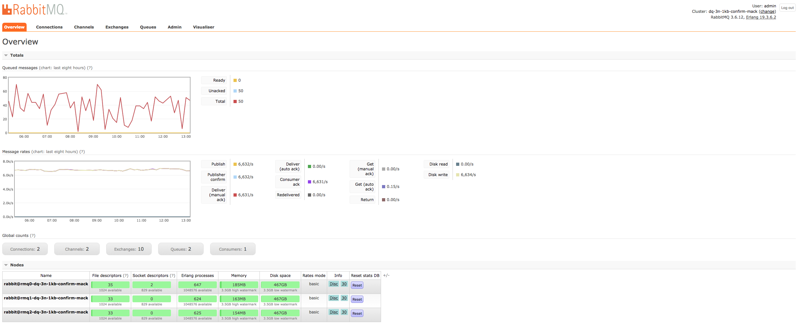
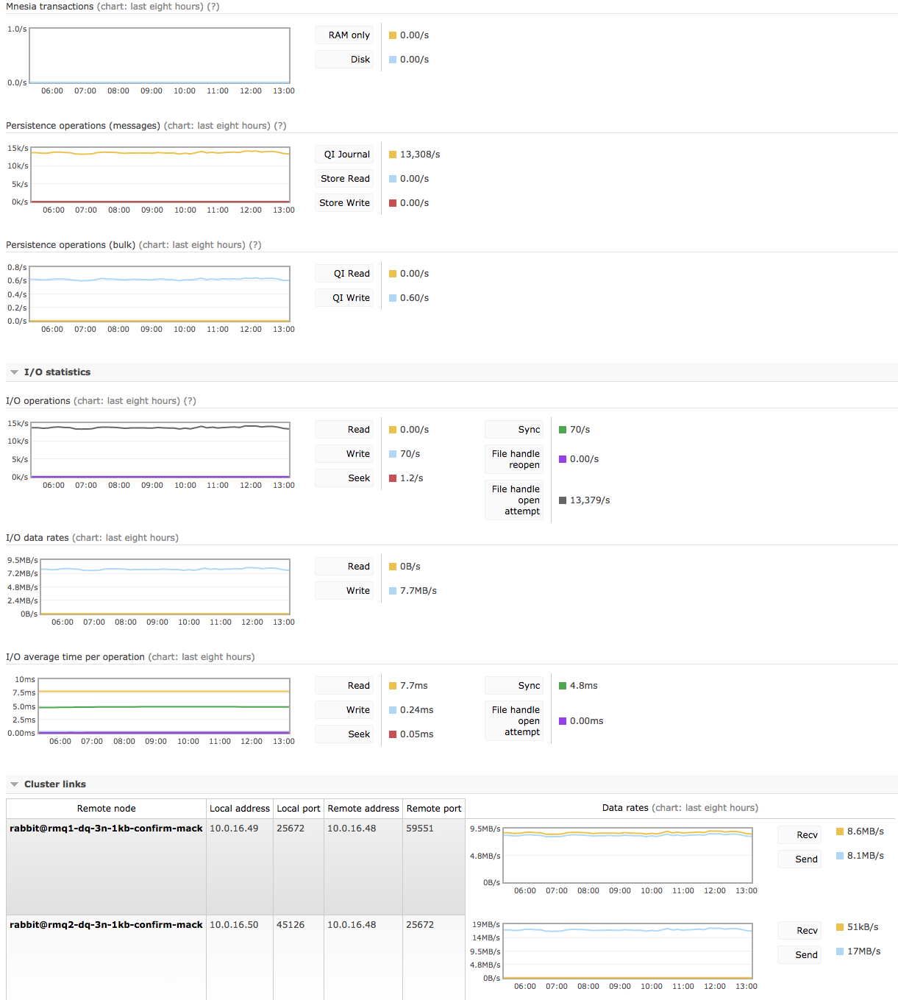

## Use-case

### Messages are ordered

In order for message order to be preserved, we must use a single RabbitMQ queue.

### Messages cannot be lost

Messages will be persisted to disk, across multiple nodes.

### Messages must have 3N redundancy

There will be 3 fully redundant copies for every message at all times.
There will be no service impact if 2 out of 3 nodes fail.

### Publisher confirms

We want the broker to confirm messages once they are persisted to disk across all nodes.

### Consumer confirms

We cannot flood consumers with messages, consumers must acknowledge messages as they get processed.

## Setup

This is a setup that maximizes availability and consistency.
There are 3 layers of full redundancy that need to synchronize for all operations, which will reflect in message throughput.

We limit the size of messages to 1KB since it's a sensible default that is most likely to exist in real-world scenarios.

Our RabbitMQ node has 8 CPU cores, which translates to 8 Erlang schedulers.
To achieve optimal Erlang scheduler utilization, we have 1 producer and 1 consumer with 1 connection & 1 channel each.
This means that we have 2 connection processes, 2 channel processes, 1 queue process & 1 queue synchronisation process (6 processes in total), spread across 8 Erlang schedulers.
Since our use-case is CPU & network-intensive, we chose an n1-highcpu-8 instance type.

Here is a summary of our configuration:

| PROPERTY             | VALUE          |
| -------------------- | -------------  |
| GCP INSTANCE TYPE    | n1-highcpu-8   |
| QUEUE                | durable        |
| QUEUE MIRRORS        | 3              |
| PUBLISHERS           | 1              |
| PUBLISHER RATE MSG/S | unlimited      |
| PUBLISHER CONFIRMS   | every 200 msgs |
| MSG SIZE             | 1000           |
| CONSUMERS            | 1              |
| CONSUMER RATE MSG/S  | unlimited      |
| QOS (PREFETCH)       | 200            |
| MULTI-ACK            | every 50 msgs  |

## Observations

### Links

* [RabbitMQ Management](https://dq-3n-1kb-confirm-mack.gcp.rabbitmq.com/) - username **demo** &amp; password **demo**
* [Netdata dashboard queue master](https://0-netdata-dq-3n-1kb-confirm-mack.gcp.rabbitmq.com/)
* [Netdata dashboard queue mirror 1](https://1-netdata-dq-3n-1kb-confirm-mack.gcp.rabbitmq.com/)
* [Netdata dashboard queue mirror 2](https://2-netdata-dq-3n-1kb-confirm-mack.gcp.rabbitmq.com/)
* [DataDog dashboard](https://p.datadoghq.com/sb/eac1d6667-5abde23a53)
