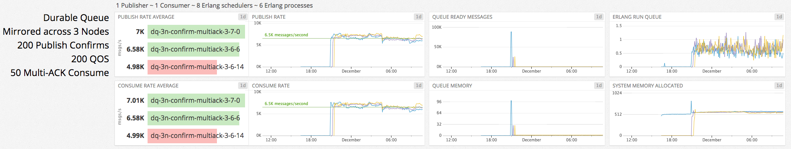
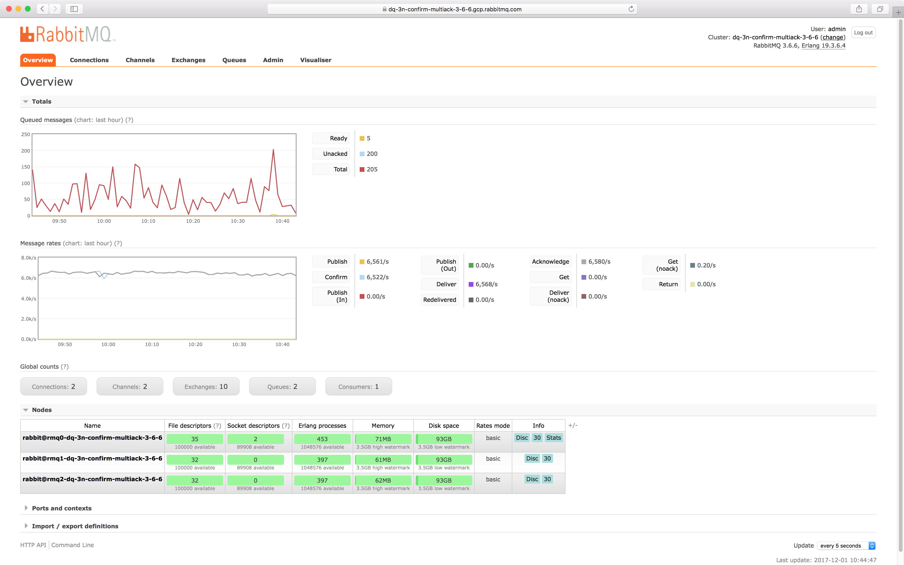
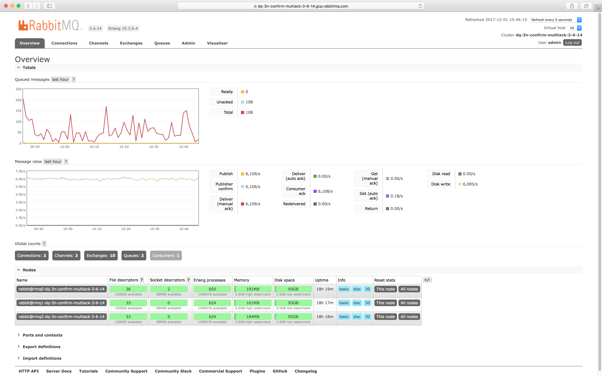
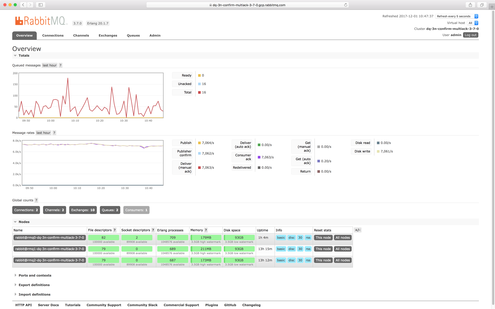

## User Goals

This sample workload addresses a specific use case. The user requires a messaging system that meets the following goals:

### Messages are ordered

If you want to preserve message order, you must use a single RabbitMQ queue.

### Message persistence is a priority

Your publishers will receive confirmations when messages have been written to disk by all nodes in the cluster.

Your consumers will send acknowledgements to the broker when messages have been processed.

### Messages must have 3N redundancy

You will have 3 fully redundant copies of each message at all times.

### Consumers regulate message delivery rate

Since consumers cannot be flooded with messages, your consumers must acknowledge messages as they are processed.

## Setup

This is a setup that maximizes availability and consistency.
There are 3 nodes across which all operations need to synchronize, which will reflect in message throughput.

We limit the size of messages to 1KB. This is a sensible default that is most likely to exist in real-world scenarios.

Our RabbitMQ node has 8 CPU cores, which translates to 8 Erlang schedulers.
To achieve optimal Erlang scheduler utilization, we have 1 producer and 1 consumer with 1 connection & 1 channel each.
This means that we have 2 connection processes, 2 channel processes, 1 queue process & 1 queue synchronisation process (6 processes in total), spread across 8 Erlang schedulers.

Since our use-case is CPU & network-intensive, we chose an [n1-highcpu-8](https://cloud.google.com/compute/docs/machine-types) instance type: 2048 MB/s network capacity.

All messages are persistent, therefore each RabbitMQ node has a dedicated 100GB SSD drive: 3000 max read IOPS, 3000 max write IOPS, 48 MB/s max read throughput &amp; 48 MB/s max write throughput.

Setup summary:

| PROPERTY                         | VALUE          |
| -                                | -              |
| INSTANCE TYPE                    | n1-highcpu-8   |
| INSTANCE NET CAP MB/s            | 2048           |
| INSTANCES IN CLUSTER             | 3              |
| INSTANCE MONTHLY COST (PREEMPT.) | $53.44         |
| INSTANCE DISK SIZE GB            | 100            |
| INSTANCE DISK READ IOPS          | 3000           |
| INSTANCE DISK WRITE IOPS         | 3000           |
| INSTANCE DISK READ MB/s          | 48             |
| INSTANCE DISK WRITE MB/s         | 48             |
| INSTANCE DISK MONTHLY COST       | $20.40         |
| QUEUE                            | durable        |
| QUEUE MIRRORS                    | 3              |
| PUBLISHERS                       | 1              |
| PUBLISHER RATE MSG/S             | unlimited      |
| PUBLISHER CONFIRMS               | every 200 msgs |
| MSG SIZE bytes                   | 1000           |
| CONSUMERS                        | 1              |
| CONSUMER RATE MSG/S              | unlimited      |
| QOS (PREFETCH)                   | 200            |
| MULTI-ACK                        | every 50 msgs  |

## Links

[DataDog dashboard](https://p.datadoghq.com/sb/eac1d6667-75ac04872a)

| RabbitMQ | Metrics                                                                     | Management URL (self-signed SSL cert)                                                   | Username | Password |
| -        | -                                                                           | -                                                                                       | -        | -        |
| v3.6.6   | [Netdata](https://0-netdata-dq-3n-confirm-multiack-3-6-6.gcp.rabbitmq.com)  | [dq-3n-confirm-multiack-3-6-6](https://dq-3n-confirm-multiack-3-6-6.gcp.rabbitmq.com)   | **demo** | **demo** |
| v3.6.14  | [Netdata](https://0-netdata-dq-3n-confirm-multiack-3-6-14.gcp.rabbitmq.com) | [dq-3n-confirm-multiack-3-6-14](https://dq-3n-confirm-multiack-3-6-14.gcp.rabbitmq.com) | **demo** | **demo** |
| v3.7.0   | [Netdata](https://0-netdata-dq-3n-confirm-multiack-3-7-0.gcp.rabbitmq.com)  | [dq-3n-confirm-multiack-3-7-0](https://dq-3n-confirm-multiack-3-7-0.gcp.rabbitmq.com)   | **demo** | **demo** |

## Point-in-time observations

### RabbitMQ v3.6.6

### RabbitMQ v3.6.14

### RabbitMQ v3.7.0

