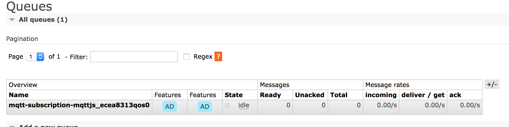

# Internet Of Things

The goal of this workload is to learn about IoT workload, get to know use cases, architectural patterns and its requirements.

The term **Internet of Things** was first used by [Kevin Ashton](http://www.rfidjournal.com/article/view/4986) in 2009 for interconnecting physical devices over the internet. The basic idea is very simple: **Physical devices can exchange data between each other or being controlled by others**.

The communication between the huge amount of devices is enabled by IPv6 and lightweight communication protocols like MQTT.

## MQTT

The goals of MQTT were to have a protocol, which is bandwidth-efficient and uses little battery power.

The protocol uses a publish/subscribe architecture in contrast to HTTP with its request/response paradigm. Publish/Subscribe is event-driven and enables messages to be pushed to clients. The central communication point is the MQTT broker, it is in charge of dispatching all messages between the senders and the rightful receivers. Each client that publishes a message to the broker, includes a topic into the message.

The *topic* is the routing information for the broker. A topic is a simple string that can have more hierarchy levels, which are separated by a slash.

By default, every message will be sent to the `amq.topic` exchange using the MQTT *topic* as the routing key.

# MQTT in RabbitMQ

As of RabbitMQ 3.7.x, it supports MQTT 3.1.1 via a [plugin](https://www.rabbitmq.com/mqtt.html). Check [here](https://www.rabbitmq.com/mqtt.html#features) for the list of supported features.

## Set up

Before we run any of the experiments we need the following:

[] Docker installed
[] RabbitMQ Docker image. To build it, check out `git@github.com:rabbitmq/rabbitmq.git` and run `cd 3.7/ubuntu/management && docker build --build-arg PGP_KEYSERVER="pgpkeys.co.uk" -t rabbitmq-mgt-ubuntu .`
[] mqtt-client Docker image. To build it run `cd mqtt-client && docker build -t mqtt .`

## Experiment 1 - MQTT enabled with anonymous access and a default vhost

**default MQTT port**

When no configuration is specified the MQTT plugin will listen on all interfaces on port `1883`. However, we have explicitly [configured](experiments/1-experiment/conf/rabbitmq.conf) it.
  ```
  mqtt.listeners.tcp.1 = 1883
  ```

**anonymous access**

MQTT supports optional authentication. To enable anonymous authentication over MQTT we need to configure the default user RabbitMQ would use. Here we are using `guest`/`guest` user.
  ```
  mqtt.default_user = guest
  mqtt.default_pass = guest
  mqtt.allow_anonymous = true
  ```

**default vhost**

MQTT does not have the concept of *vhost* however RabbitMQ does. If MQTT client does not provide one, we configure the default vhost we want to use for MQTT messaging. Here we are using the default vhost.
  ```
  mqtt.vhost = /
  ```

Follow the next steps to start RabbitMQ server with MQTT and see two MQTT clients in action, a publisher and a consumer.

1. Start RabbitMQ with MQTT and Management plugin enabled
  ```
  ./start-rabbitmq
  ```
2. To check the management UI is available run:
  ```
  curl  -u guest:guest http://localhost:15672/api/overview | jq .
  ```
3. To check mqtt plugin is running in RabbitMQ:
  ```
  docker exec -it rabbitmq-1 rabbitmqctl status
  ```
  We should expect `{rabbitmq_mqtt,"RabbitMQ MQTT Adapter","3.7.8"},` and `{mqtt,1883,"::"},`.

4. Start a MQTT anonymous consumer which listens on `temperature` *topic*.
  ```
  ./start-consumer my-consumer -C mqtt -h rabbitmq -p 1883 -t "temperature" -v
  ```
  Check in the management UI the queue created by our consumer.

  

5. Start a MQTT anonymous publisher which sends two messages to the `temperature` *topic*.
  ```
  ./publisher my-publisher -C mqtt -h rabbitmq -p 1883 -t "temperature" -m "124.2"
  ./publisher my-publisher -C mqtt -h rabbitmq -p 1883 -t "temperature" -m "124.3"
  ```
  Check the consumer logs
  ```
  docker logs my-consumer
  ```
  It should print out
  ```
  temperature 124.2
  temperature 124.3
  ```
6. Stop RabbitMQ and the consumer
  ```
  ./stop-rabbitmq
  ./stop-consumer my-consumer
  ```
  After we stop the consumer, its queue disappears.


## Experiment N - Authenticate users with TLS/X.509 certificates

## Experiment N - Enable multiple vhosts

## Experiment N - Handle large number of connections

The plugin supports TCP listener option configuration. The settings use a common prefix, mqtt.tcp_listen_options, and control things such as TCP buffer sizes, inbound TCP connection queue length, whether TCP keepalives are enabled and so on.

## Experiment N - MQTT with TLS

[TLS Support](https://www.rabbitmq.com/mqtt.html#tls)
