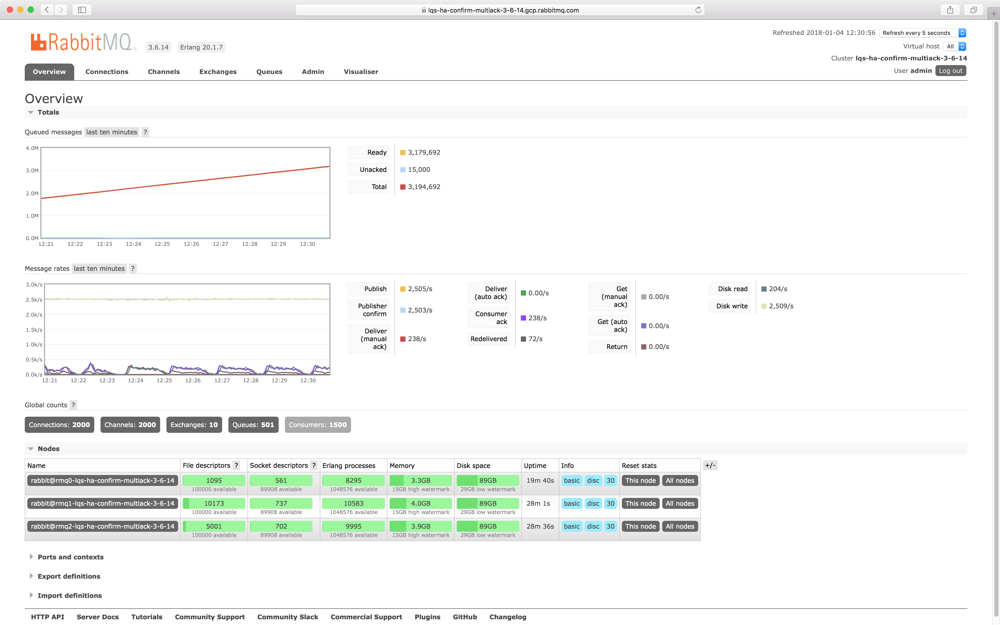

## Requirements

### Messages cannot be lost

Publishers will receive confirmations when messages have been persisted to disk by all nodes in the cluster.

Consumers will send acknowledgements to the broker when messages have been processed.

### Messages must have 3N redundancy

There will be 3 fully redundant copies for every message at all times.
There will be no service impact if 2 out of 3 nodes fail.

### Confirm message persistence and replication

We want the broker to confirm messages once they are persisted to disk across all nodes.

### Consumers regulate message delivery rate

We cannot flood consumers with messages, consumers must acknowledge messages as they get processed.

### Old messages will start getting discarded when queues are full

All queues have a maximum capacity defined as `max-length`.
Once this limit is reached, old messages will start getting discarded to make room for the new messages.

### Messages in queues exceed the available node memory

Given many queues per node which combined have more messages than available system memory,
RabbitMQ nodes and the cluster as a whole continue to operate as expected during IaaS events such as:

* VM preemption
* 100s of connections terminating abruptly
* 100s of new connections initiating at the same

## Setup

All messages are limited to 1,000 bytes and are flushed to disk as soon as possible (a.k.a. [lazy queues](https://www.rabbitmq.com/lazy-queues.html)).
The goal is to only load messages in memory when requested by consumers, and otherwise keep them on disk.
Lazy queues are ideal for very long queues, with many millions of messages, or for many long queues, e.g. `300 queues x 100,000 messages = 30,000,000 messages`.
Because each message takes 1KB, the disk space taken by 3M messages will be at least ~30GB.
RabbitMQ message store implementation compacts files when they have more than 50% of unused space,
which means that in the worst case it can take up to ~60GB.

In our scenario, we have 300 queues across a 3 node cluster.
Since all queues are automatically replicated across all nodes, there are ~100 queue masters and ~200 queue mirrors on every node.

Every queue has 1 producer (or publisher) and 3 consumers.
The goal is to have a single producer consistently outpace a few consumers so that we can build a message backlog larger than the available system memory.
Producers are throttled so that we have a steady message ingress across all queues.
Consumers are throttled so that a message backlog can build up without having the [consumer bias](https://www.rabbitmq.com/blog/2014/04/10/consumer-bias-in-rabbitmq-3-3/) prioritise consumers over producers.

Since producers are always outpacing consumers, it is important to limit the size of the queues so that the disk alarm doesn't get triggered - this will block all publishing, cluster-wide.
Worth pointing out, the disks are 100GB in size, so we must ensure that nodes do not run out of disk space.
As a result, each queue has the `max-length` set to 50,000.
This means that once there are 50,000 messages in a queue, old messages, the ones at the head of the queue, will start getting dropped so that new messages can be accepted without exceeding the `max-length` limit.

When using high number of queues which persist messages to the message store, each queue will use separate set of file
descriptors. File descriptors are released only after message store delete files. This can cause high file descriptor
usage by RabbitMQ process. It's recommended to [increase file limit to run RabbitMQ up to 500K](https://rabbitmq.com/production-checklist.html#resource-limits-file-handle-limit). It's also recommended to use bigger file sizes
in the message store. You can increase the message store file size by setting `msg_store_file_size_limit`
in rabbitmq configuration

Our RabbitMQ node has 8 CPU cores and therefore 8 Erlang schedulers, our workload could easily overwhelm the Erlang VMs if not limited (another reason for throttling producers and consumers).
Given that there are 300 connection processes, 300 channel processes &amp; 300 fully mirrored queues always workings, we have at least ~1,000 always active Erlang processes requiring wall time on 8 schedulers.
We will keep a close eye on the Erlang run queue, since a value `> 10` is an indicator of Erlang scheduler contention.

Setup summary:

| PROPERTY                         | VALUE          |
| -                                | -              |
| INSTANCE TYPE                    | n1-standard-8  |
| INSTANCE NET CAP MB/s            | 2048           |
| INSTANCES IN CLUSTER             | 3              |
| INSTANCE MONTHLY COST (PREEMPT.) | $64.24         |
| INSTANCE DISK SIZE GB            | 100            |
| INSTANCE DISK READ IOPS          | 3000           |
| INSTANCE DISK WRITE IOPS         | 3000           |
| INSTANCE DISK READ MB/s          | 48             |
| INSTANCE DISK WRITE MB/s         | 48             |
| INSTANCE DISK MONTHLY COST       | $20.40         |
| QUEUES                           | 300            |
| QUEUE                            | durable + lazy |
| QUEUE MIRRORS                    | 3              |
| QUEUE MAX-LENGTH                 | 100000         |
| PUBLISHERS                       | 300            |
| PUBLISHER RATE MSG/S             | 5              |
| PUBLISHER CONFIRMS               | every 10 msgs  |
| MSG SIZE bytes                   | 1000           |
| CONSUMERS                        | 900            |
| CONSUMER RATE MSG/S              | 1              |
| QOS (PREFETCH)                   | 10             |
| MULTI-ACK                        | every 10 msgs  |

Policies:

| Name             | Pattern | Apply to | Definition                                                                  |
| -                | -       | -        | -                                                                           |
| lazy-ha-all-100k | .*      | queues   | ha-mode: all, ha-sync-mode: automatic, max-length: 50000, queue-mode: lazy |

## Details

### `x-max-length`

Since producers will be outpacing consumers all the time, queues should be limited by `max-length=50000` configured
in the policy.

### `msg_store_file_size_limit`

To limit number of open files, message store files should be bigger. `msg_store_file_size_limit` RabbitMQ
application setting is set 8 times beger than default to 134217728.

## Links

| RabbitMQ | Node Metrics                                                                                                                                                                                                                  | Cluster Metrics                                            | Management URL (self-signed SSL cert)                                                     | Username | Password |
| -        | -                                                                                                                                                                                                                             | -                                                          | -                                                                                         | -        | -        |
| v3.6.14  | [rmq0](https://0-netdata-lqs-ha-confirm-multiack-3-6-14.gcp.rabbitmq.com) [rmq1](https://1-netdata-lqs-ha-confirm-multiack-3-6-14.gcp.rabbitmq.com) [rmq2](https://2-netdata-lqs-ha-confirm-multiack-3-6-14.gcp.rabbitmq.com) | [Datadog](https://p.datadoghq.com/sb/eac1d6667-75ac04872a) | [lqs-ha-confirm-multiack-3-6-14](https://lqs-ha-confirm-multiack-3-6-14.gcp.rabbitmq.com) | **demo** | **demo** |

## Point-in-time observations

### RabbitMQ v3.6.14

