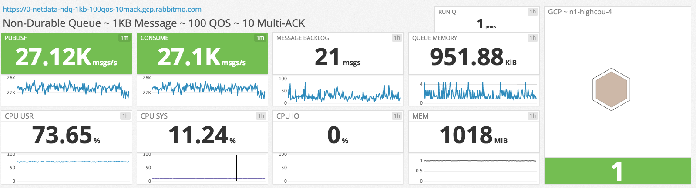

## Non-durable queue, 1KB messages, consumer multi-ACKs



```
| GCP INSTANCE TYPE    | n1-highcpu-4  |
| -------------------- | ------------  |
| QUEUE                | non-durable   |
| MAX-LENGTH           | 250,000       |
| -------------------- | ------------  |
| PUBLISHERS           | 2             |
| PUBLISHER RATE MSG/S | ∞             |
| MSG SIZE             | 1000          |
| -------------------- | ------------  |
| CONSUMERS            | 2             |
| CONSUMER RATE MSG/S  | ∞             |
| QOS (PREFETCH)       | 100           |
| MULTI-ACK            | every 10 msgs |
```

### `vm_memory_high_watermark_paging_ratio`

When messages are paged to disk, all other queue operations are blocked, including arriving messages from producers and sending messages to consumers.

We set `vm_memory_high_watermark_paging_ratio` to `100.0` so that messages are never paged to disk, not even under memory pressure.
This is a risky setting and must be used in conjunction with the rest of the settings mentioned in this use-case.

### `vm_memory_high_watermark`

Not paging messages to disk when under memory pressure can exhaust all available system memory and result in RabbitMQ termination.
To ensure this doesn't happen, we set `vm_memory_high_watermark` to `0.5`.
For this setting to work correctly, ensure you are using RabbitMQ 3.6.11 or higher [\[1\]](#3.6.11-mem).

### `x-max-length`

If consumers get restarted or stopped, producers can create a significant message backlog.
Since we have disabled message paging to disk, our message backlog is held entirely in memory and can result in the memory alarm getting triggered.
When the memory alarm gets triggered, all producers will be blocked.

So what happens when there are no consumers and producers are blocked by the memory alarm?

Since RabbitMQ is continuously garbage collecting and defragmenting memory, producers will get blocked and unblocked many times, as the memory alarm gets raised and cleared.
At some point, RabbitMQ will not be able to release enough memory to clear the memory alarm and publishers will remain blocked until consumers start making progress on the message backlog.

Since we do not want our publishers blocked, our only other option is to start dropping messages [\[2\]](#queues-dont-fix-overload).

We limit the number of messages in our queue to 250,000.
Once there are 250,000 messages in the queue, the queue will start dropping messages from the head, meaning the oldest messages will be dropped first.
This will reduce performance since the queue process has more work to do, but it will keep the system as a whole in a stable, non-blocked state.
The producers will not be blocked, as would be the case if the memory alarm got triggered, so messages will continue flowing, even if at a reduced rate.

### Consumer Bias

The consumer bias ensures that when a queue is under pressure from both consumers and producers, it prioritises consumers.
If it didn't, a queue with a backlog of messages would never make progress on its backlog, since both produce and consume operations would have the same priority.
We all know that the fastest queue is an empty queue [\[3\]](#2.6.1-performance-of-queues), so the quicker a queue becomes empty, the quicker it reaches peak performance.
The reason for this is simple: when the queue is empty, producer channels send messages directly to consumer channels.

The consumer bias that was introduced in RabbitMQ 3.3 [\[4\]](#3.3-consumer-bias) had a consume to produce ratio of `1.1:1`, meaning that for every 1 new message, deliver at least 1.1 messages.
This ratio would result in slow progress on queue message backlogs.

In 3.6.13 we changed the consume to produce ratio to `2:1`, meaning that for every 1 new message, deliver at least 2 messages.

We have experimented with removing the consumer bias, since it complicates the queue's hot code path and therefore reduces throughput, but PerfTest benchmarks proved that this has a detrimental effect [\[5\]](#rabbitmq-server-1378).

### Notes

* <a name="3.6.11-mem">\[1\]</a>: [ANN Default node RAM consumption calculation strategy will change in 3.6.11](https://groups.google.com/forum/#!msg/rabbitmq-users/TVZt45O3WzU/jkG4SK_rAQAJ)
* <a name="queues-dont-fix-overload">\[2\]</a>: [Queues Don't Fix Overload](https://ferd.ca/queues-don-t-fix-overload.html)
* <a name="2.6.1-performance-of-queues">\[3\]</a>: [Performance of Queues: when less is more](http://www.rabbitmq.com/blog/2011/10/27/performance-of-queues-when-less-is-more/)
* <a name="3.3-consumer-bias">\[4\]</a>: [Consumer Bias in RabbitMQ 3.3](http://www.rabbitmq.com/blog/2014/04/10/consumer-bias-in-rabbitmq-3-3/)
* <a name="rabbitmq-server-1378">\[5\]</a>: [Remove consumer bias & allow queues under max load to drain quickly](https://github.com/rabbitmq/rabbitmq-server/pull/1378)
