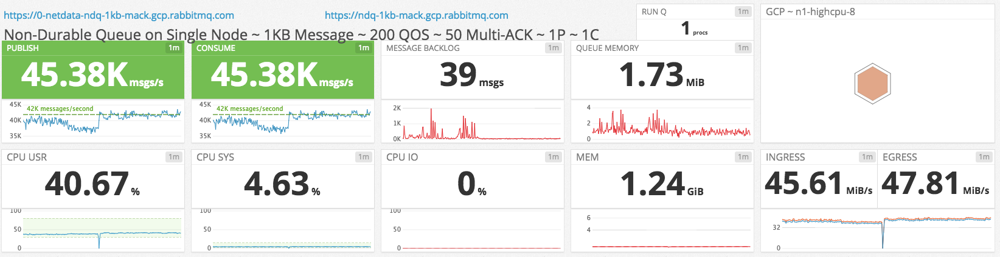

## Use-case

### Messages are ordered

In order for message order to be preserved, we must use a single RabbitMQ queue.

### Messages can be lost

To achieve maximum throughput, we only keep messages in memory and use a single RabbitMQ node.
We disable message paging to disk and limit the queue length so that memory growth is bounded.

### Consumer confirms

We cannot flood consumers with messages, consumers must acknowledge messages as they get processed.

## Setup

We limit the size of messages to 1KB since it's a sensible default that is most likely to exist in real-world scenarios.

To ensure messages are only kept in memory, we publish transient messages to a non-durable queue.
We disable paging to disk via `vm_memory_high_watermark_paging_ratio` and limit the number of messages in the queue via `x-max-length`.
As a precaution, we set the `vm_memory_high_watermark` to half the available RAM.
Reaching the memory high watermark is unlikely, we set `x-max-length`.

To achieve maximum message throughput, consumers acknowledge messages in batches of 50 and prefetch messages in batches of 200.
These numbers are specific to our environment, they will not be optimal for any other environment.

Our RabbitMQ node has 8 CPU cores, which translates to 8 Erlang schedulers.
To achieve optimal Erlang scheduler utilization, we have 1 producer and 1 consumer with 1 connection & 1 channel each.
This means that we have 2 connection processes, 2 channel processes & 1 queue process (5 processes in total), spread across 8 Erlang schedulers.
Since our use-case is CPU & network-intensive, we chose an n1-highcpu-8 instance type.

Here is a summary of our configuration:

| PROPERTY             | VALUE         |
| -------------------- | ------------- |
| GCP INSTANCE TYPE    | n1-highcpu-8  |
| QUEUE                | non-durable   |
| QUEUE MAX-LENGTH     | 250,000       |
| PUBLISHERS           | 1             |
| PUBLISHER RATE MSG/S | unlimited     |
| MSG SIZE             | 1000          |
| CONSUMERS            | 1             |
| CONSUMER RATE MSG/S  | unlimited     |
| QOS (PREFETCH)       | 200           |
| MULTI-ACK            | every 50 msgs |

## Observations

## Details

### `vm_memory_high_watermark_paging_ratio`

When messages are paged to disk, all other queue operations are blocked, including arriving messages from producers and sending messages to consumers.

We set `vm_memory_high_watermark_paging_ratio` to `100.0` so that messages are never paged to disk, not even under memory pressure.
This is a risky setting and must be used in conjunction with the rest of the settings mentioned in this use-case.

### `vm_memory_high_watermark`

Not paging messages to disk when under memory pressure can exhaust all available system memory and result in RabbitMQ termination.
To ensure this doesn't happen, we set `vm_memory_high_watermark` to `0.5`.
For this setting to work correctly, ensure you are using RabbitMQ 3.6.11 or higher [\[1\]](#3.6.11-mem).

### `x-max-length`

If consumers get restarted or stopped, producers can create a significant message backlog.
Since we have disabled message paging to disk, our message backlog is held entirely in memory and can result in the memory alarm getting triggered.
When the memory alarm gets triggered, all producers will be blocked.

So what happens when there are no consumers and producers are blocked by the memory alarm?

Since RabbitMQ is continuously garbage collecting and defragmenting memory, producers will get blocked and unblocked many times, as the memory alarm gets raised and cleared.
At some point, RabbitMQ will not be able to release enough memory to clear the memory alarm and publishers will remain blocked until consumers start making progress on the message backlog.

Since we do not want our publishers blocked, our only other option is to start dropping messages [\[2\]](#queues-dont-fix-overload).

We limit the number of messages in our queue to 250,000.
Once there are 250,000 messages in the queue, the queue will start dropping messages from the head, meaning the oldest messages will be dropped first.
This will reduce performance since the queue process has more work to do, but it will keep the system as a whole in a stable, non-blocked state.
The producers will not be blocked, as would be the case if the memory alarm got triggered, so messages will continue flowing, even if at a reduced rate.

### Links

* [RabbitMQ Management](https://ndq-1kb-mack.gcp.rabbitmq.com/)
* [Netdata dashboard](https://0-netdata-ndq-1kb-mack.gcp.rabbitmq.com/)
* [DataDog dashboard](https://p.datadoghq.com/sb/eac1d6667-5abde23a53)

### Notes

* <a name="3.6.11-mem">\[1\]</a>: [ANN Default node RAM consumption calculation strategy will change in 3.6.11](https://groups.google.com/forum/#!msg/rabbitmq-users/TVZt45O3WzU/jkG4SK_rAQAJ)
* <a name="queues-dont-fix-overload">\[2\]</a>: [Queues Don't Fix Overload](https://ferd.ca/queues-don-t-fix-overload.html)
