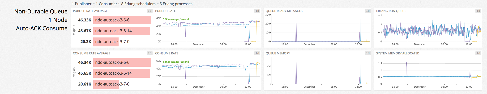
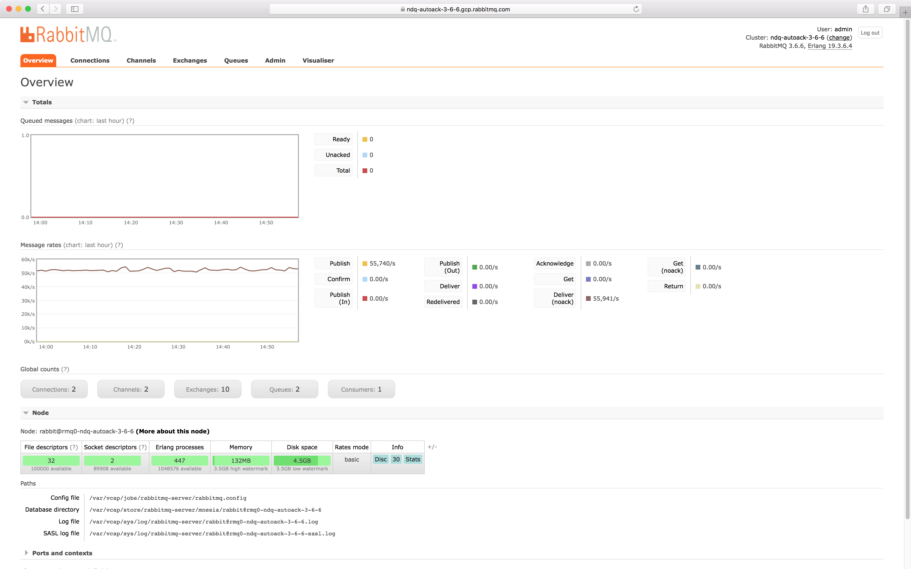
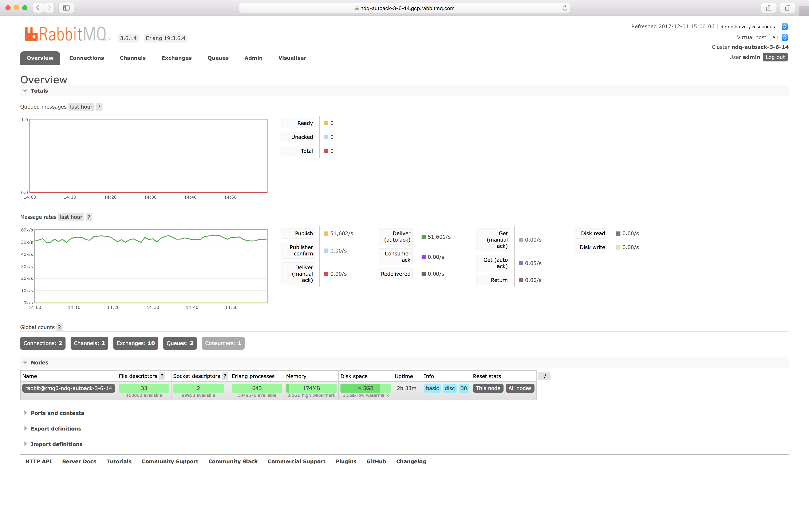
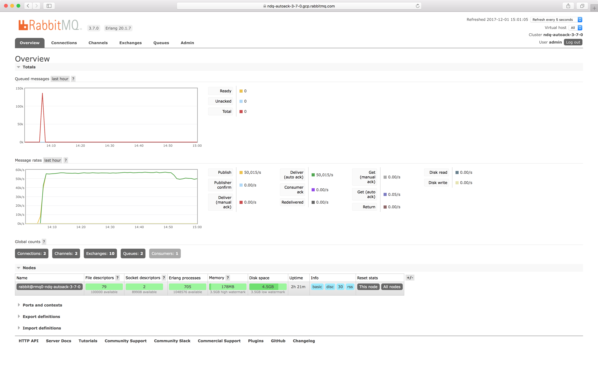

## Requirements

### Messages are ordered

In order for message order to be preserved, we must use a single RabbitMQ queue.

### Messages can be lost

To achieve maximum throughput, we only keep messages in memory and use a single RabbitMQ node (mirroring a queue across multiple nodes will affect throughput).
We disable message paging to disk and limit the queue length so that memory growth is bounded and messages never reach the disk, not even under memory pressure.

### Messages are received as fast as possible

Producers do not wait for the broker to confirm that messages were received, they will publish as fast as possible.

### Messages are delivered to consumers as fast as possible

To achieve maximum message delivery throughput, RabbitMQ does not wait for consumers to confirm messages.

## Setup

We limit the size of messages to 1KB since it's a sensible default that is most likely to exist in real-world scenarios.

To ensure that messages never reach the disk, we publish transient messages to a non-durable queue.
We disable paging to disk via `vm_memory_high_watermark_paging_ratio` and limit the number of messages in the queue via `x-max-length`.
As a precaution, we set the `vm_memory_high_watermark` to half the available RAM.
Reaching the memory high watermark is unlikely, we set `x-max-length` on the queue.

To achieve maximum message throughput, RabbitMQ will accept messages as fast as possible and will not send publisher confirms.
Messages will be delivered as fast as possible, the broker will not wait for consumers to acknowledge when messages get processed.

Our RabbitMQ node has 8 CPU cores, which translates to 8 Erlang schedulers.
To achieve optimal Erlang scheduler utilization, we have 1 producer and 1 consumer with 1 connection & 1 channel each.
This means that we have 2 connection processes, 2 channel processes & 1 queue process (5 processes in total), spread across 8 Erlang schedulers.

Since our use-case is CPU & network-intensive, we chose an [n1-highcpu-8](https://cloud.google.com/compute/docs/machine-types) instance type: 2048 MB/s network capacity.

Since messages are transient, the RabbitMQ node has a 5GB SSD drive for minimal persistence: 150 max read IOPS, 150 max write IOPS, 2.4 MB/s max read throughput &amp; 2.4 MB/s max write throughput.

Setup summary:

| PROPERTY                         | VALUE        |
| -                                | -            |
| INSTANCE TYPE                    | n1-highcpu-8 |
| INSTANCE NET CAP MB/s            | 2048         |
| INSTANCE MONTHLY COST (PREEMPT.) | $53.44       |
| INSTANCE DISK SIZE GB            | 5            |
| INSTANCE DISK READ IOPS          | 150          |
| INSTANCE DISK WRITE IOPS         | 150          |
| INSTANCE DISK READ MB/s          | 2.4          |
| INSTANCE DISK WRITE MB/s         | 2.4          |
| INSTANCE DISK MONTHLY COST       | $1.02        |
| QUEUE                            | non-durable  |
| QUEUE MAX-LENGTH                 | 250,000      |
| PUBLISHERS                       | 1            |
| PUBLISHER RATE MSG/S             | unlimited    |
| MSG SIZE bytes                   | 1000         |
| CONSUMERS                        | 1            |
| CONSUMER RATE MSG/S              | unlimited    |

## Links

[DataDog dashboard](https://p.datadoghq.com/sb/eac1d6667-75ac04872a)

| RabbitMQ | Metrics                                                          | Management URL (self-signed SSL cert)                             | Username | Password |
| -        | -                                                                | -                                                                 | -        | -        |
| v3.6.6   | [Netdata](https://0-netdata-ndq-autoack-3-6-6.gcp.rabbitmq.com)  | [ndq-autoack-3-6-6](https://ndq-autoack-3-6-6.gcp.rabbitmq.com)   | **demo** | **demo** |
| v3.6.14  | [Netdata](https://0-netdata-ndq-autoack-3-6-14.gcp.rabbitmq.com) | [ndq-autoack-3-6-14](https://ndq-autoack-3-6-14.gcp.rabbitmq.com) | **demo** | **demo** |
| v3.7.0   | [Netdata](https://0-netdata-ndq-autoack-3-7-0.gcp.rabbitmq.com)  | [ndq-autoack-3-7-0](https://ndq-autoack-3-7-0.gcp.rabbitmq.com)   | **demo** | **demo** |

## Point-in-time observations

### RabbitMQ v3.6.6

### RabbitMQ v3.6.14

### RabbitMQ v3.7.0

