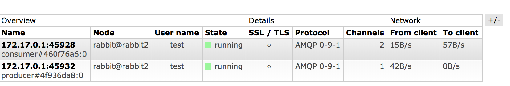

## Resilient Java applications upon AMQP failures

The goal of this workload is to provide guidance to developers on how to write Java applications -that uses
[RabbitMQ Java AMQP](https://www.rabbitmq.com/java-client.html) or [Spring AMQP](https://docs.spring.io/spring-amqp/reference/html/)- which are resilient to failures.

The type of failures we are going to handle are:
- RabbitMQ node goes down expectedly (e.g. during a rolling upgrade) or unexpectedly
- Entire RabbitMQ cluster goes down
- Connection abruptly closed
- Channel failure  
- Fatal consumer errors (e.g. poisonous message)


## Patterns for applications that uses Spring AMQP client

We are going to build a basic application incrementally. We are going to be challenging the application with a number of failures. On every commit, we are going to improve it so that it can gracefully handle it.

If you want to run the code follow the steps on the next sections otherwise if you are only interested in the patterns you can go straight to the [Reference Spring AMQP application](#Reference_Spring_AMQP_application) section.

### Getting the code and building the application

We will need Java 1.8 and at least Maven 3.3.x to build the application.

  ```
  git clone https://github.com/rabbitmq/workloads
  cd workloads/resiliency/resilient-spring-rabbitmq
  mvn install
  ```

### To run the application locally

To run the application locally we need to provide the following environment variables:
```
export SPRING_PROFILES_ACTIVE=Cloud
export VCAP_APPLICATION='{"application_name":"demo"}'
export VCAP_SERVICES="$(cat src/main/resources/cluster.json)"
```

To run the application within IntelliJ, copy the file `ResilientSpringRabbitmqApplication.xml` to folder `.idea/runConfigurations`.  

Either `src/main/resources/cluster.json` or `ResilientSpringRabbitmqApplication.xml` have the credentials to a 3 node RabbitMQ cluster running in localhost on ports 5672, 5673 and 5674 respectively.  

#### To run a 3-node cluster locally

To run a 3-node cluster locally, follow these steps. You will need docker installed in your machine:

```
git clone https://github.com/harbur/docker-rabbitmq-cluster
cd docker-rabbitmq-cluster
docker-compose up -d
```

The application is configured (`src/main/resources/cluster.json`) to connect to the 3-node cluster with a user called `test` and password `test`.
This means that the application will not be able to connect right after we bring the cluster up because it comes with the default user `guest:guest`.

This is on purpose so that we can reproduce situations where we connect to a cluster which has not yet the configured user.
To add the user to the running cluster follow these steps:
```
$ docker exec -it docker-rabbitmq-cluster_rabbit1_1 /bin/bash -c 'rabbitmqctl add_user test test; rabbitmqctl set_permissions test ".*" ".*" ".*"; rabbitmqctl set_user_tags test administrator'
```

### To deploy the application to Cloud Foundry

First we need to provision a RabbitMQ cluster. [RabbitMQ for PCF](https://docs.pivotal.io/rabbitmq-cf/1-14/index.html) have 2 service offerings.

The [pre-provisioned](https://docs.pivotal.io/rabbitmq-cf/1-14/deploying.html) offering which consists of  a multi-tenant RabbitMQ cluster with a **ha-proxy** in front of it. Applications will connect to RabbitMQ via the single address, the **ha-proxy** address.
> This offering will be deprecated soon

To create an on-demand RabbitMQ instance, we do it like this:
```
 cf create-service p-rabbitmq standard rmq
```

The other offering, called [On-Demand PCF RabbitMQ](https://docs.pivotal.io/rabbitmq-cf/1-14/about.html), allows us to create a dedicated RabbitMQ cluster without any **ha-proxy** in front of it. Applications will connect directly to any of the RabbitMQ nodes in the cluster. And they decide to which node they want to connect to. And in the event of a node failure, they should connect to other nodes.

To create an on-demand RabbitMQ instance, we do it like this. We need to choose one of the available plans:
```
 cf create-service p.rabbitmq <plan-name> rmq
```

Now we can push the application. It uses the local `manifest.yml` file which references the `rmq` service we just created.
```
cf push
```

### Reference Spring AMQP application

We start with a plain Spring boot application with Spring AMQP library created by [Spring initializer](https://start.spring.io/).

[f9f8ba2](https://github.com/rabbitmq/workloads/commit/f9f8ba2)

This application as it stands, reads the RabbitMQ credentials from applications properties, which by default, connects to `localhost:5672`. To deploy in Cloud Foundry, we are going to use [Spring Cloud Connectors](https://cloud.spring.io/spring-cloud-connectors/) to get an instance of ` org.springframework.amqp.rabbit.connection.ConnectionFactory` already configured with the credentials to connect to RabbitMQ cluster. This is the reason for these 2 dependencies in the `pom.xml`:
```
<dependency>
  <groupId>org.springframework.cloud</groupId>
  <artifactId>spring-cloud-spring-service-connector</artifactId>
</dependency>
<dependency>
  <groupId>org.springframework.cloud</groupId>
  <artifactId>spring-cloud-cloudfoundry-connector</artifactId>
</dependency>
```

Furthermore, the only Java class that depends on [Spring Cloud Connectors](https://cloud.spring.io/spring-cloud-connectors/) is the `@Configuration` class, [RabbitMQConfiguration](https://github.com/rabbitmq/workloads/blob/master/resiliency/resilient-spring-rabbitmq/src/main/java/com/pivotal/resilient/RabbitMQConfiguration.java) which builds the required `org.springframework.amqp.rabbit.connection.ConnectionFactory`.
[2a2b01f](https://github.com/rabbitmq/workloads/commit/2a2b01f)

We are going to start building the messaging application by adding a basic producer which sends messages every 5sec to a durable exchange and a basic consumer which consumes messages from a durable queue bound to the durable exchange. The application will be responsible for the declaration of the aforementioned AMQP resources.
[e88a705](https://github.com/rabbitmq/workloads/commit/e88a705)

### Types of failures/situations

Now that we have the application ready, we are going to improve its resiliency by challenging it with a number of failures.

#### Application starts up with the entire cluster down
It could happen that when we deploy our application, the entire RabbitMQ cluster is down. This could be because we are in the middle of a cluster upgrade which required to bring the entire cluster. Or the cluster is down due for maintenance reasons.

We could have chosen to crash instead and let Cloud Foundry to restart it again. But we prefer the application to start and stay up and running even when it cannot connect to RabbitMQ. To make it even better, the application should report in it health status that it is out of service if it cannot connect to RabbitMQ (best practice).

Our application as it stands (commit_id [e88a705](https://github.com/rabbitmq/workloads/commit/e88a705)) can start without RabbitMQ being available. Spring AMQP will continuously try to connect indefinitely right out of the box.

However, be aware that if we try to use RabbitMQ while Spring is still initializing the application, the application will crash.
[6601573](https://github.com/rabbitmq/workloads/commit/6601573)

#### Application cannot connect due to authentication failures
It is an application design decision whether our application should crash if it cannot connect due to authentication or access control failures like this one :
```
Caused by: com.rabbitmq.client.AuthenticationFailureException: ACCESS_REFUSED - Login was refused using authentication mechanism PLAIN. For details see the broker logfile.
```

This situation may happen if:
- We lose all the users in the RabbitMQ cluster (e.g. due to database corruption we had to delete **mnesia** database). The operator starts the RabbitMQ cluster without the users. The application connects to RabbitMQ but the users (or their permissions) are not there yet. And finally the operator imports/adds the users and their permissions.
- During blue/green deployment, applications switch to the new/blue cluster before all the data -including users- has been fully restored.   

The producer will get an exception when it tries to publish but Spring Scheduling (see `@Scheduled` annotation) will keep calling the producer's logic. But the consumer will fail to declare the queue and abort and terminate the application. This is because by default it is instructed to terminate if it encounter an authentication error.
To make the consumer survive this situation we need to configure the consumer accordingly.
[cfa3736](https://github.com/rabbitmq/workloads/commit/cfa3736)

#### RabbitMQ node becomes unavailable with applications connected to it
A RabbitMQ node may become unavailable should any of these events occurred:
  - network partition occurs which isolates the application from the node  (reminder: heartbeats 60sec)
  - network partition occurs which pauses the node (in case of pause minority)
  - node crashes
  - operator stops the node
  - operator closes the connection
  - operator is performing a rolling upgrade (e.g. Upgrade *PCF RabbitMQ 1.13.8 / RabbitMQ 3.7.7* to *RabbitMQ 3.7.8 (PCF RabbitMQ 1.13.7*)

If we are using **On-Demand RabbitMQ for PCF** offering, our application gets the address of every node in the cluster. Spring AMQP will automatically try to connect to next node in the list.

If we are using **Pre-Provision RabbitMQ for PCF** offering, our application only gets one address, the HA-proxy's address. Spring AMQP will keep trying to connect to that single address.

**TL;DR** : This is as far as the connection recovery is concerned. Spring AMQP will automatically recover the connection if there is an available node. However, our application may still crash due to buggy logic in the consumer and/or producer.

In the next sections we are going to address the resiliency of consumers when we lose the connection. We contemplate the following 2 scenarios: one with durable queues and another with non-durable queues, both non-mirrored.

#### RabbitMQ node with non-mirrored durable queues becomes unavailable
The producer will not experience any connection/AMQP failures. However, published messages may be lost.
How do we prevent message loss in this case?
- Either we use mandatory flag (be aware of the performance impact this flag may have. Read more [here](https://www.rabbitmq.com/blog/2012/04/25/rabbitmq-performance-measurements-part-2/).
- Use [Alternate exchange](https://www.rabbitmq.com/ae.html)

The consumer will get shutdown and its respective channel closed.
```
Caused by: com.rabbitmq.client.ShutdownSignalException: channel error; protocol method: #method<channel.close>(reply-code=404, reply-text=NOT_FOUND - home node 'rabbit@rabbit1' of durable queue 'durable-q' in vhost '/' is down or inaccessible, class-id=50, method-id=10)
```
And after 3 failed attempts to recover it, the consumer is shutdown forever.
```
2018-11-23 16:24:54.632 ERROR 88230 --- [nDurableQueue-2] o.s.a.r.l.SimpleMessageListenerContainer : Stopping container from aborted consumer
2018-11-23 16:24:54.633  INFO 88230 --- [nDurableQueue-2] o.s.a.r.l.SimpleMessageListenerContainer : Waiting for workers to finish.
2018-11-23 16:24:54.633  INFO 88230 --- [nDurableQueue-2] o.s.a.r.l.SimpleMessageListenerContainer : Successfully waited for workers to finish.
```
Message consumption is not possible while the node remains unavailable and RabbitMQ will not let the application to declare it either. Durable queues can only exist in one node therefore when the node goes down, the cluster makes the queue not only unavailable but also it will prevent any attempts to redeclare it.

To make our consumer resilient to this failure, we need to configure with the flag `MissingQueuesFatal` equal to `false`.

#### RabbitMQ node with non-mirrored non-durable queues becomes unavailable
We added a new pair of consumer-producer components to our application but this pair with declare a non-durable exchange and a non-durable queue.
(1d91839)[https://github.com/rabbitmq/workloads/commit/1d91839]

At first we may expect the non-durable consumer will be able to re-declare the non-durable queue in the new connected node. But we encounter an issue. The Spring AMQP consumer (`SimpleMessageListenerContainer`) delegates the resource declaration to default instance of `RabbitAdmin`. This instance is configured such that if it fails to declare one resource, it fails the rest.  

We need to create a custom `RabbitAdmin` with the flag `ignoreDeclarationExceptions` set to `true` and configure the `ConnectionFactory` with this instance.

[2722f1f](https://github.com/rabbitmq/workloads/commit/2722f1f)

#### RabbitMQ cluster raises an alarm
When RabbitMQ cluster raises a memory and/or disk alarm, it blocks all producer connections. If we have consumers and producers sharing the same connection, consumers will not receive more messages until the alarm is cleared. On the other hand, connections with only consumers will still receive messages.
Producers will block indefinitely when they publish to a channel on a **blocked** connection.

We should create separate connections for consumption and publishing messages. Spring AMQP actually facilitates the job by exposing a new method in the `ConnectionFactory` called `getPublisherConnectionFactory()`. We need to change our consumers and producers so that they get the correct `ConnectionFactory`. Choose the `producer` `ConnectionFactory` as the `@Primary` or default one.

[550f6ec](https://github.com/rabbitmq/workloads/commit/550f6ec)

It would also be great if we could identify which connection is which when we look at the management UI. Spring AMQP allows us to inject our own `ConnectionNamingStrategy` but we can leverage the existing strategy. We can give it a meaningful name to the `@Bean` of each `ConnectionFactory` and Spring AMQP will use it.



## Patterns for applications that uses RabbitMQ Java client

We are going to build a basic application incrementally. We are going to be challenging the application with a number of failures. On every commit, we are going to improve it so that it can gracefully handle it.

If you want to run the code follow the steps on the next sections otherwise if you are only interested in the patterns you can go straight to the [Reference Java AMQP application](#Reference_Java_AMQP_application) section.

### Getting the code and building the application

We will need Java 1.8 and at least Maven 3.3.x to build the application.

  ```
  git clone https://github.com/rabbitmq/workloads
  cd workloads/resiliency/resilient-java-rabbitmq
  mvn install
  ```

### To run the application locally

To run the application locally we need to provide the following environment variables:
```
export SPRING_PROFILES_ACTIVE=Cloud
export VCAP_APPLICATION='{"application_name":"demo"}'
export VCAP_SERVICES="$(cat src/main/resources/cluster.json)"
```

To run the application within IntelliJ, copy the file `ResilientApplication.xml` to folder `.idea/runConfigurations`.  

Either `src/main/resources/cluster.json` or `ResilientApplication.xml` have the credentials to a 3 node RabbitMQ cluster running in localhost on ports 5672, 5673 and 5674 respectively.  


### Reference Java AMQP application

We start with an application which has already all the patterns incorporated rather than incrementally building them as we did it with the [Spring AMQP application](#Reference_Spring_AMQP_application) earlier.

This application also uses [Spring Cloud Connectors](https://cloud.spring.io/spring-cloud-connectors/) but this time to get credentials to build an instance of  `com.rabbitmq.client.ConnectionFactory`. This is the reason for these 2 dependencies in the `pom.xml`:
```
<dependency>
  <groupId>org.springframework.cloud</groupId>
  <artifactId>spring-cloud-spring-service-connector</artifactId>
</dependency>
<dependency>
  <groupId>org.springframework.cloud</groupId>
  <artifactId>spring-cloud-cloudfoundry-connector</artifactId>
</dependency>
```

### Types of failures/situations

Now that we have the application ready, we are going to visit how we handle various failures.

#### Application starts up with the entire cluster down

[RabbitMQ Java AMQP](https://www.rabbitmq.com/java-client.html) has built-in mechanism to recover from a network connection problem. But the application has to first establish the connection.

We should delay all AMQP operations, be it publishing, declaring resources or consuming from queue, until we have a connection. We follow the **Hollywood Principle** : *Don't call us, we'll call you*.

An application component that needs to publish a message will have to request it and when the connection is available, it is notified.

`AMQPConnectionProvider` is the class that applications components requests a connection like this:
```
  Producer producer = ...
  List<AMQPResource> producerResources =  ...
  amqpConnectionProvider.requestConnectionFor("my producer", producerResources, producer);
```

And applications components must implement an interface, `AMQPConnectionRequester`, with the corresponding methods such as `void connectionAvailable(Connection connection)`.

An application will always need an AMQP resource to operate. A publisher will need an exchange and a consumer a queue, and the possibility to bind the queue to the exchange.
To that end, when an application component requests a connection, it can also specify the list of AMQP resources it will need before passing the connection.

With this very simple pattern, we have many components in our application which will get invoked only when there is a connection and their AMQP resources are available.

`AMQPConnectionProvider` is constantly making sure that all application components are fully attended. If they have not received a connection yet, it will periodically attempt to establish a connection.

#### Application cannot connect due to authentication failures

The application could encounter this issue right from the start, when it is trying to establish the first connection. Or it happen while connected.

In the former case, the `AMQPConnectionProvider` logs the failure but keeps trying to establish the connection. It will never crash until we stop the application.

In the latter case, the Java AMPQ library will handle the connection recovery. When we create the `ConnectionFactory`, we explicitly set it to automatically recover connections.

From `RabbitMQConfiguration`:
```
   ....
   @Bean
   public ConnectionFactory amqpConnectionFactory(Cloud cloud) {
       ConnectionFactory factory = new ConnectionFactory();

       initConnetionFactoryWithAMQPCredentials(cloud, factory);

       factory.setAutomaticRecoveryEnabled(true);
       factory.setTopologyRecoveryEnabled(false);
       factory.setConnectionTimeout(10000);
       factory.setNetworkRecoveryInterval(1000); // how long will automatic recovery wait before attempting to reconnect, in ms; default is 5000

       logger.info("Creating connection factory using username:{}, vhost:{}", factory.getUsername(), factory.getVirtualHost());

       return factory;
   }
   ....
```

#### RabbitMQ node becomes unavailable with applications connected to it

In the Patterns for applications that uses Spring AMQP client, we covered all the situations that could lead to a node become unavailable.

Java AMQP library will automatically recover the connection(s). It will try indefinitely with a configurable interval (`ConnectionFactory.setNetworkRecoveryInterval`). Java AMQP will also randomly pick one address from the provided list of addresses.

As an application developer, we probably want our application components to react when we lose a connection or when we get it back. For instance, we could stop threads/timers we used to publish messages. Or we could flag our application components as *out of service* so that we can fail-fast, or simply report its status via a `health` endpoint.

`Publisher.SendAtFixedRate` convenient class is an example of a `AMQPConnectionRequester` which will schedule a task to publish a message at a fixed interval when it gets a connection ( `connectionAvailable` method):
```
@Override
public void connectionAvailable(Connection connection) {
    logger.info("{} has received a connection. Scheduling producer timer", getName());
    if (sendMessageAtFixedRate != null) {
        return; // it is already running. This method can be called several times for the same connection
    }

    sendMessageAtFixedRate = scheduler.scheduleAtFixedRate(() -> send(connection), this.fixedRate);
}
```
But it will cancel the scheduled task if it loses the connection:
```
  @Override
   public void connectionLost() {
       logger.info("{} has received a connection. Scheduling producer timer", getName());
       if (sendMessageAtFixedRate != null) {
           sendMessageAtFixedRate.cancel(true);
           sendMessageAtFixedRate = null;
       }
   }
```

#### RabbitMQ node with non-mirrored durable queues becomes unavailable

When an application requires **High Availability**, and more specifically **High Message Availability**,
the options are either to use [Mirrored Queues](https://www.rabbitmq.com/ha.html) or Sharding.
> Sharding is a rather long topic that we will address it in a future guide. But in a nutshell, it is about partitioning a
standard queue into multiple queues and host those queues on different nodes. Messages are then spread onto those partitions
 hence increasing the availability.
However if we lose a node with a partition queue, the messages in that node will not be available until the node comes back. But at least we have not
entirely lost the queue.
To use Sharding, we can either partition the queues ourselves and use [Consistent Hash exchange plugin](https://github.com/rabbitmq/rabbitmq-consistent-hash-exchange) to spread the messages. Or use the [Sharding plugin](https://github.com/rabbitmq/rabbitmq-sharding) instead so that RabbitMQ takes care of partitioning the queue.

Publishers will not detect any problem except if they use the [mandatory](https://www.rabbitmq.com/amqp-0-9-1-reference.html#basic.publish.mandatory) flag. Even if they
used [Publisher Confirms](https://www.rabbitmq.com/confirms.html) they will not notice any errors when we lose a node. However, be aware of the [performance impact](https://www.rabbitmq.com/blog/2012/04/25/rabbitmq-performance-measurements-part-2/) of the [mandatory](https://www.rabbitmq.com/amqp-0-9-1-reference.html#basic.publish.mandatory) flag.

Consumers, in the contrary, will get their subscription shutdown (`com.rabbitmq.client.ShutdownSignalException`) and its channel closed. So, here comes two recommendations:
- the obvious one is to always handle the shutdown signal. Do not subscribe only when we establish a connection. We could get the subscription shutdown for other reasons not just when we lose a connection.
- use one channel per component/consumer, do not share it for other usage. The consumer could abruptly get its channel closed due to a failed AMQP operation or it could be closed by others if we shared the channel. So, do not share the channel.

To make our consumers resilient to this failure, each `AMQPConnectionRequester` will report its status/health via the callback method `boolean isHealthy()`. A consumer is not healthy if it has no subscription. An `AMQPConnectionProvider` will check the health of each requester a certain interval. If an `AMQPConnectionRequester` is not healthy, it calls `connectionAvailable` in an attempt to restore its service.

Sample code from `Consumer` class where we handle the ShutdownSignalException:
```
  ...
  private void handleShutdownSignal(String consumerTag, ShutdownSignalException sig) {
      logger.warn("{} received shutdownSignal event on consumerTag {}", getName(), consumerTag);
      consumerTag = null;
      closeSubscriptionChannel();
  }

  private AtomicReference<Channel> subscriptionChannel = new AtomicReference<>();

  private void closeSubscriptionChannel() {
      Channel channel = subscriptionChannel.getAndSet(null);
      if (channel == null) {
          return;
      }
      try {
          channel.close();
      } catch (IOException | TimeoutException e) {
          logger.warn("Failed to close channel. Ignore", e);
          throw new RuntimeException(e);
      }
  }
  ...

```

Sample code from `Consumer` class that determines its health based on whether it has any subscription.
```
  ...
  @Override
  public boolean isHealthy() {
      return subscriptionChannel.get() != null;
  }
  ...
```

Sample code from `Consumer` class where it establishes a subscription when it receives a connection:
```
@Override
public void connectionAvailable(Connection connection) {
    try {
        subscribeForMessages(connection);
    }catch(IOException e) {
        e.printStackTrace();
        logger.error("{} failed to consume messages", getName(), e.getMessage());
    }
}
```

The other recommendation is never to expect that resource declaration will always succeed. The reasons why we may fail to declare a resource are:
- we declare a durable queue which is already declared but the node is not available
- we declare a resource (queue, exchange) which is already declared but with a different configuration. It is unlikely that a queue which was initially configured as durable changes to non-durable or the other way around. But it is more likely that we change some its arguments like `x-message-ttl`. Here comes another recommendation, never programatically configure queues and/or exchanges via arguments; use [policies](https://www.rabbitmq.com/parameters.html) instead. If you do not use policies, you would have to delete the queue/exchange to change its arguments.

Sample code from `amqpConnectionProviderImpl` class where we handle resource declaration failures. When an `AMQPConnectionRequester` requests a connection to an `AMQPConnectionProvider` it can specify which AMQPResource(s) it requires to operate. The `AMQPConnectionProvider` will make sure that those resources are available before passing a connection to the `AMQPConnectionRequester`. Furthermore, some `AMQPConnectionRequester` could be happily working while others not because `AMQPConnectionProvider` could not satisfy them.
> This is an oversimplification. There could be complex application which may not know which resources they need right from the start. In that case, it is the application developer who should handle these failures.
```
    ...
    private void declareResources(AMQPConnectionRequest request, final Channel channel) {
       request.getRequiredResources().forEach(resource -> {
           try {
               amqpDeclarations.get(resource.getClass()).declare(resource, channel);
           } catch (IOException e) {
               // why could it fail?
               // 1) unexpected connection dropped
               // 2) wrong permissions
               // 3) ??
               logger.warn("Failed to declare resources for {}. Due to {}", request.getName(), e.getCause().getMessage());
               throw new RuntimeException(e);
           } catch (IllegalStateException e) {
               // when we pass invalid configuration
               // tell requester that it has wrong configuration configuration but let the other services to carry on ?
               // or maybe this is a good reason to terminate the app
               logger.warn("Failed to declare resources for {}. Due to wrong configuration: {}", request.getName(), e.getMessage());
               throw e;
           }
       });
   }
   ....
```

#### RabbitMQ node with non-mirrored non-durable queues becomes unavailable

If our application can tolerate message loss, non-durable queues is the best choice to achieve **Highly available queues**.

We could encounter 2 type of failure or situations. One where our consumer application was connected to the node hosting the non-durable queue. If the node goes down, the application looses the connection, Java AMQP library recovers the connection, the consumer detects that its subscription was shutdown. Eventually, the `AMQPConnectionProvider` detects the consumer is not healthy and it passes the connection so that it can subscribe.
The second failure is when our consumer application is connected to a node which does not host the non-durable queue. If the hosting queue node goes down, the application does not loose the connection but the consumer gets its subscription shutdown. Both are handled by the current design.

Be aware that Java RabbitMQ client has a feature called [Topology recovery](https://www.rabbitmq.com/api-guide.html#recovery) which re-declares AMQP resources (including bindings) and consumers. But in our reference application we have decided to disable this feature and always redeclare the resources and consumers.  


#### RabbitMQ cluster raises an alarm

The advise here is the same one we did for the Spring AMQP application; that is, dedicate a connection to consume messages and another one to publish.

The `RabbitMQConfiguration` class builds not just one `AMQPConnectionProvider` but two; one called *producer* and another *consumer*. And these names will be used to name the connection too so that we can clearly identify them in the management UI. Being the *producer* the default one.

All we need to do is to inject or wire the right `AMQPConnectionProvider` to the application component.

This producer gets injected the default, or `@Primary`, `AMQPConnectionProvider`.
```
public class ProducerConsumerWithDurableQueue {

    @Bean
    public Producer durableProducer(TaskScheduler taskScheduler, AMQPConnectionProvider amqpConnectionProvider) {
        ....
```   

Whereas, the consumer gets injected the *consumer*:
```
    @Bean
    public Consumer durableConsumer(@Qualifier("consumer") AMQPConnectionProvider amqpConnectionProvider) {
        ...
```

A second advise is to detect when the connection is blocked and use it in the application. For instance, we could implement a back-pressure mechanism. Publisher will not send and block but fail-fast and report upstreams that it is not available. Or record this situation via its health status which we can expose it thru the actuator `/health` endpoint.   
