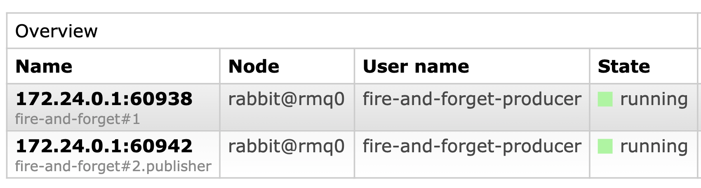
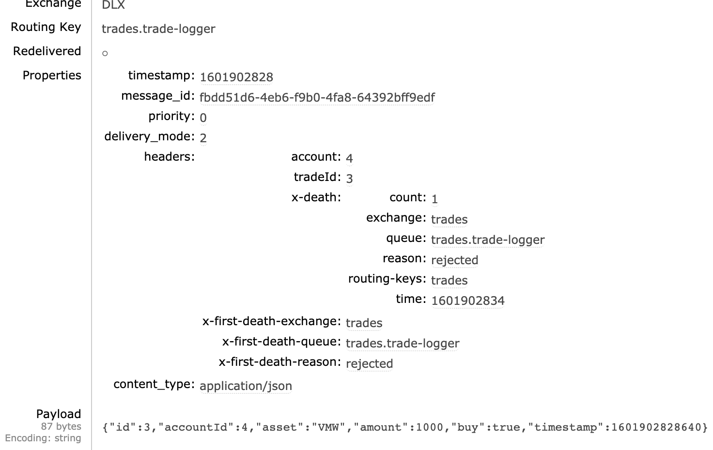
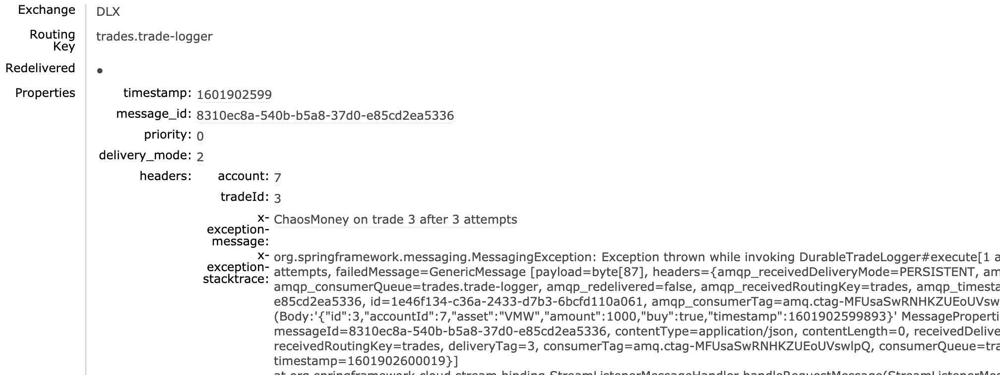

# Spring Cloud Stream Resiliency Workshop

The goal of this workshop is to provide guidance to developers on how to write Spring Cloud Stream applications which are resilient to failures and guarantee message delivery, or put it another words, that it does not loose messages.

## What you will learn

This is a self-guided workshop on which you will learn:
- levels of resiliency
- what patterns/techniques/configurations to use to achieve certain level of resiliency
- how to test the resiliency's levels

## Audience

This workshop is intended for developers who are already using Spring Cloud Stream or
planning to use it. This is not a workshop to learn Spring Cloud Stream. Therefore, it requires
some knowledge of Spring Cloud Stream and Spring Boot to follow it.

## Prerequisites

To follow this workshop you need:
- Java 1.8
- Maven 3.6.2 or more recent
- Docker

## How to follow the workshop

1. Go straight to [Getting started](#getting-started) so that you get all the sample
 code and learn how to build it.

   Applications provided in this workshop have been configured to access a 3-node cluster running at localhost.
   This workshop provides various scripts to start and stop a 3-node cluster using Docker.

2. Then continue with the section [Application types](#application-types) where you will learn why there are
various types of applications and what levels of resiliency you can expect from each type.

    By the end of this section, you have identified the type of application you need.

3. And finally, you move onto the last section [Testing Applications](#testing-applications) where you are  going to test the resiliency of these applications.

    For each type of failure, there are two test scenarios. The **unhappy** path -prefixed with the symbol :x:- where you test an application which is **not** resilient to the failure. And a **happy** path -prefixed with the symbol :white_check_mark:- where you test an application which is resilient to the failure.

    There is a [resiliency matrix](#resiliency-matrix) that can help you assess which application is right for you depending on what failures is able to handle.

**Table of content**


## Getting started

### Get the entire workshop

```
git clone https://github.com/rabbitmq/workloads
cd workloads/resiliency/resilient-spring-cloud-stream
```

:information_source: Any sample script, for instance to deploy a rabbitmq cluster,
 assumes we are on the `workloads/resiliency/resilient-spring-cloud-stream` folder.

### Building the code

It is highly recommended to build all projects together by running the following
command from the root of this folder, `resilient-spring-cloud-stream`:
```bash
mvn
```

### How projects are structured

There is a root [pom.xml](pom.xml) that builds all the application types.
All application types such as `basic-producer` or `transient-consumer` inherits (maven term)
from a common [parent](parent) project. The `parent` project centralizes dependencies and plugin configuration
required by the children projects.

All the code shared by the application types resides in the [common](common) project. Therefore,
all applications types has `common` as a dependency too.

### How to deploy RabbitMQ

By default, all the sample applications are configured to connect to a 3-node cluster.
Under `src/main/resources` we can find a `application-cluster.yml` file with
RabbitMQ's binder configuration that looks like this:
```yaml
spring:
  cloud:
    stream:
      binders:
        local_rabbit:
          type: rabbit
          defaultCandidate: true
          environment:
            spring:
              rabbitmq:
                addresses: localhost:5673,localhost:5674,localhost:5675
                username: guest
                password: guest
                virtual-host: /

```
And every application is configured with the `cluster` profile under their `application.yml`,
similar to this configuration:
```yaml
spring:
  application:
    name: transient-consumer
  profiles:
    include:
      - management
      - cluster
```

To launch the corresponding 3-node cluster, we run the script:
```bash
docker/deploy-rabbit-cluster
```

To launch the application against a single standalone server, edit `application.yml`
and remove `cluster` as one of the included Spring profiles. And to deploy a standalone server run:
```bash
docker/deploy-rabbit
```
> It will deploy a standalone server on port 5672

## Application types

Not all applications requires the same level of resiliency, or message delivery guarantee or
tolerance to downtime. For this reason, we are going to create [different kinds of consumer and producer applications](#application-types), where each type gives us certain level of resiliency and/or guarantee of delivery. And then we are going to [test](#testing-applications) them against various [failure scenarios](#failure-scenarios).

### Transient consumer

A **transient consumer** only receives messages which were sent after the consumer has connected to the broker and declared its *non-durable* queue bound to the corresponding *exchange*. If the consumer disconnects from the broker, it looses the queue and all its messages.

This type of consumer creates a queue named `<channel_destination_name>.anonymous.<unique_id>` e.g. `q_trade_confirmations.anonymous.XbaJDGmDT7mNEgD6_ru9zw` with this attributes:
  - *non-durable*
  - *exclusive*
  - *auto-delete*   

We can find an example of this type of consumer in the project [transient-consumer](transient-consumer).

It consists of 2 Spring `@Service`(s):
- `ScheduledTradeRequester` is a producer service
- `TradeLogger` is a transient consumer service

**TODO** Does it help to include some snippets of SCS configuration and sample code?

This application automatically declares the AMQP resources such as exchanges, queues and bindings.

#### What is this consumer useful for

- monitoring/dashboard applications which provide real-time stats;
- audit/logger applications which sends messages to a persistent state such as
ELK;
- keep local-cache up-to-date

#### What about data loss

As we already know, it will not get messages which are delivered while it is not connected.
Once connected, the consumer uses *Client Auto Acknowledgement* therefore it will not lose queued messages, as long as it is connected. Once it disconnects, or it looses the connection, all queued messages are lost.

If we are using this type of consumer to keep a local-cache up-to-date with updates
that come via messages, we need to know when we are processing the first message so that
we clear the cache and prime it.
> You can add a ApplicationListener<ListenerContainerConsumerFailedEvent> and listen for AsyncConsumerStartedEvent(s). More info [here](https://docs.spring.io/spring-amqp/reference/html/#async-consumer).

#### Is this consumer highly available

This consumer is **highly available** as long as the broker has at least one node where to connect. The consumer will always recreate the queue, therefore the queue it uses is non-durable, auto-delete and exclusive.

**IMPORTANT**: We should not include this type of queues in HA policies because an *auto-delete* queue will be automatically deleted as soon as its last consumer is cancelled or when the connection is lost.

#### Is this consumer resilient to connection failures

There are different reasons why we may experience connections failure:

- The application cannot establish the first connection because the cluster is not available
- The application is connected to a node and it goes down
- The application cannot establish the connection because the credentials are wrong
- The application is connected to a a node and it is paused (e.g. due to network partition)

Check out the resiliency of this type of application in the [resiliency matrix](#resiliency-matrix) below.

#### What other failures this consumer has to deal with

Other failures have to do with AMQP resource availability. Let's discuss the
two possible scenarios:

**Application-managed AMQP resources**

By default, this consumer is configured to declare the exchange and the queue. Producers and consumers have to agree on the exchange name (`bindings.<channelName>.destination`) and type (default is
*Topic Exchange*). If we do not change the type of exchange there are fewer chances for
failures. If they used a different exchange type then the first application to declare it
will succeed and the latter will fail.

**Externally-managed AMQP resources**

In the contrary, we may choose to declare the AMQP exchange externally. When the application
starts up, the resources must be available otherwise the application will fail. However, we can configure the application to keep retrying until the resource is declared. Or give up and terminate after N failed attempts.


### Durable consumer

A **durable consumer** receives messages sent after the consumer connected to the broker
and created the *durable queue* bound to the corresponding *exchange*. However, contrary to
the [Transient consumer](#transient-consumer), when **Durable consumer** disconnects from the broker, the queue remains in the broker receiving more messages. Once the **Durable consumer** reconnects to the broker, all the messages that were posted in the meantime will be delivered.

We can find an example of this type of consumer in the project [durable-consumer](durable-consumer).
It consists of one durable consumer called `DurableTradeLogger`. This service uses a *Consumer Group* called after its name `trade-logger` which creates a durable queue called
`queue.trade-logger`.

We switched to durable subscriptions so that we did not lose messages. However, we need to
ensure that the message producer uses `deliveryMode: PERSISTENT` which is the default
value though. If the producer did not send messages as persistent, they will be lost
if the queue's hosting node goes down.

#### What about data loss

The consumer uses *Client Auto Acknowledgement* therefore it will not lose
 messages due to failures that may occur while processing the message.

However, queued messages -i.e. messages which are already in the queue- may be lost if
the messages are not sent with the *persistent flag*. By default, Spring Cloud Stream will
send messages as persistent unless we change it. Non-persistent messages are only kept
in memory and if the queue's hosting node goes down, they will be lost.

*IMPORTANT*: We are always taking about queued messages. We are not talking yet about all kind of messages, including those which are about to be sent by the producer.


#### Is this consumer highly available

By default, this consumer is **not highly available**. Its uptime depends on the
uptime of queue's hosting node goes down.

Is this suitable for my case? That depends on your business case. If the consumer
can tolerate a downtime of less than an hour which is the maximum time any of nodes
can be down then this consumer is suitable. Else, we need to make it HA. Look at the [next](#highly-available-durable-consumer) type of application.

#### What about strict order processing of messages

If we need to have strict ordering of processing of messages we need to use `exclusive: true` attribute. If we have more instances, they will fail to subscribe but will retry based on the `recoveryInterval: 5000` attribute.

**TODO** investigate how to set *single-active-consumer* on SCS

### Highly available Durable consumer

In order to improve the availability of the [durable-consumer](#durable-consumer) application we need to use highly available queues so that if the queue's hosting node goes down, the broker is able to elect a replica/slave node as master node.

#### HA Durable consumer with classical mirrored queues

In order to improve the availability of the [durable-consumer](#durable-consumer) application we are going to configure the queue as mirrored.

There are two ways:
- The queue's name must follow some naming convention, e.g. `ha-*`, because there is a policy
that configures those queues as *Mirror queue*.
- Application puts (using the Management Rest API) a custom policy which configures the queue
as *Mirrored*.

#### HA Durable consumer with quorum queues

It requires [SCS 3.0.0-RELEASE](https://cloud.spring.io/spring-cloud-static/spring-cloud-stream-binder-rabbit/3.0.0.RELEASE/reference/html/spring-cloud-stream-binder-rabbit.html)

We need to configure the RabbitMQ Binder's consumer bindings with `quorum.enabled: true`.

If we want producers to declare the consumer's queue via the `requiredGroups` then we have to
also specify `quorum.enabled: true` in the RabbitMQ Binder's producer bindings.


### Reliable consumer

By default, Spring Cloud Stream uses client acknowledgement (`acknowledgeMode: AUTO)`.
This means that if our listener threw an exception while processing a message, it would not be lost. Instead, the message is nacked and returned back to the queue and delivered again. This retry mechanism is enabled by default on SCS as we will see in the [next](#dealing-with-processing-failures) section.

In order to test consumer's reliability, we need to simulate failures while processing
messages. For this reason, we have created another consumer project called [reliable-consumer](reliable-consumer). It still has the same durable consumer called `DurableTradeLogger`.


#### Dealing with processing failures

If the listener fails to process the message and throws an exception (different to `AmqpRejectAndDontRequeueException`), SCS nacks the message and the broker delivers it again.

However, if the listener keeps failing, SCS will eventually reject it and the message is lost if the queue has not been configured with a *dead-letter-queue* (see [next](#Dealing-with-processing-failures-without-losing-messages) section).

These are the consumer bindings' [settings](https://cloud.spring.io/spring-cloud-static/spring-cloud-stream/current/reference/html/spring-cloud-stream.html#_consumer_properties) that control the retries:
  - `maxAttempts: 3`
  - `backOffInitialInterval: 1000`
  - `backOffMaxInterval: 1000`
  - `defaultRetryable: true`
  - `retryableExceptions`


> We can change this behaviour with `requeueRejected: true`. But be careful changing this value because it could produce a storm of poisonous messages unless the application raises an `AmqpRejectAndDontRequeueException`.

> We should not retry exceptions related to parsing/deserializing messages and/or
business exceptions. Because it will always fail.
> Whereas, we should retry infrastructure related exceptions such as connectivity issues to downstream
services over http, jdbc, etc.


#### Dealing with processing failures without losing messages

Once the consumer has exceeded the maximum of number of retries, we want to move the message to an
error queue so that we do not lose it and it can be handled separately.

SCS RabbitMQ binder allows to configure a queue with a dead-letter-queue. All we need to do is
add a `autoBindDlq: true` to the consumer channel. Check out [application-dlq](reliable-consumer/src/main/resources/application-dlq.yml).


**VERY IMPORTANT**: Once we configure our queue with DLQ or any other features via one of the
SCS settings, we cannot change it otherwise our application fails to declare it. Moreover, if we
also configure the producer -via `requiredGroups`- to declare the queue, we will see failures
happening in both, consumer and producer. Those failures are not fatal but annoying.


### Fire-and-forget producer

This type of producer does not guarantee that the message is delivered to all
bound queues. Instead, it sends the message and forgets about it.

The following circumstances will cause a message to be lost however this producer will
never know it because it does not expect confirmation that it was sent:
- connection drops with the message in transit
- the broker rejects the message (e.g. due to *ttl* or *max-length* policy)
- the broker could not find a destination queue for it
- the broker failed to accept the message due to an internal error

We can find an example of this type of producer in the project [fire-and-forget-producer](fire-and-forget-producer). It is the `ScheduledTradeRequester` producer that we have used so far.

#### When is this type of producer useful

- When data is not massively critical and consumers can tolerate message loss.
- Especially interesting when the consumers are of type transient
- When consumers use some eviction strategy in their queues, either max-length or ttl.


### Reliable producer

First of all, let's clarify what we mean by guarantee of delivery.

There are at least 2 ways to ensure that messages do get delivered (i.e. arrive to the destination queue(s)).

 The interactive way where the sender/caller expects to get a confirmation when the message is eventually delivered or when it could not be. Depending how we implement it, the caller can wait until the message is *confirmed* before continue the business transaction or it can do it asynchronously.

 [TradeRequesterController.execute-async]() method is an example. It calls a TradeService which
 sends the message and returns back a *CompletableFuture*. Once the message is delivered -Successfully
 or not- we will know it. If it is successful, we return the delivered Trade else an error.

 The offline way where the sender/caller does not expect a confirmation, it is like the fire-and-forget.
 However, there is some logic running in the background that ensures that messages get delivered. And
 when they cannot be delivered, it notifies it somehow. Either by logging it, or sending it to an external service (http, jdbc, etc) or maybe sending it to another RabbitMQ cluster. The difference
 lies in that the sender does not need to know when or whether it was sent.

 [TradeRequesterController.execute]() method is an example. It calls a TradeService which
 sends the message and it immediately returns. At this point, we do not know whether the message
 was delivered or not. Under the covers, the `DefaultTradeService` awaits for the confirmation
 in the background, and retries if it fails. At the moment, after 3 failed attempts, it gives up
 and does nothing but logging it.

 By the way, regardless which way we use, the `DefaultTradeService` will retry failed messages.
 However, with the interactive way, the caller knows when it was delivered and can do something
 differently when it was not. It could even abort the entire transaction. Whereas with the
 offline way, we cannot.


Regardless which way we want, we must use the following core RabbitMQ features, which they will
tell us when a message was delivered and when not. By themselves will not prevent message loss.
1. Publish messages using *RabbitMQ Publisher Confirms*. A message is said to be delivered only
when we receive a confirmation for it. Without this mechanism, we are doing *fire-and-forget*.
2. Retry failed attempt to publish a message.
3. Retry *Negative Publisher Confirm* and/or *Returned* messages
4. Publish messages as *persistent* otherwise the broker may loose them when the queue is
offline (this is when the queue's hosting node goes down).

In terms of Spring Cloud Stream, this is what we need to do:
1. Declare all destination queues, a.k.a, *consumer groups*, using a new property called `requiredGroups`. A message may need to be delivered to more than one application. Hence, the producer has to be told which those *consumer groups* are.
> Note 1: If we cannot lose messages the destination queues must be durable, hence we need to use
*consumer group* feature.   
> Note 2: We are tightly coupling the producer and the consumer when we ask the producer to declare the destination queues. It is not bad nor good, it depends on your case.

2. Configure `producer.errorChannelEnabled: true` so that *send failures* are sent to an error channel for the destination. The destination's error channel is called <destinationName>.errors e.g. `destinationName.errors`
3. Configure the RabbitMQ binder so that we receive confirmations of successfully sent Trades (`producer.confirmAckChannel`). We need to specify the name of the channel. Unsuccessful confirmations are sent to the *error channel*.
4. Configure RabbitMQ's binder (`application-cluster.yml`) to use publisher confirms and publisher returns.


## Testing Applications

Out of the 5 applications we have seen, some of them gracefully handle some failures but
not others. And only two applications gracefully handle all kind of failures, or at least,
the failures we are going to test in this workshop.

### Failure scenarios

The type of failures we are going test are:

| 1 | Resiliency | 2 | Guarantee of delivery |
|:------:|-----|:----:|----|
|a|RabbitMQ is not available when application starts|a |Consumer fails to process a message|
|b|Restart/Shutdown a cluster node the application is connected to| b|Consumer terminates while processing a message|
|c|Restart/Shutdown a cluster node hosting the consumer's queue|c |Connection drops while processing a message|
|d|Rolling restart of cluster nodes|d |Consumer receives a *Poison message*|
|e|Kill/drop connection -consumer and/or producer|e|Consumer gives up after failing to process a message (same as c.)|
|f|Pause nodes|f |Producer fails to send a message (due to connection/channel errors)|
|g|Unresponsive connections|g |Broker nacks a message (i.e. sent message does not get delivered)|
| | |h |Broker returns a message (i.e. sent message does not get delivered)|
| | |i |Queue's hosting node down while sending messages to it (same as g.)|
| | |j |Broker blocks producers  |


### Resiliency Matrix

|      |  Transient consumer  | Durable consumer  | HA Durable consumer  | Reliable consumer  | Fire-and-forget producer  | Reliable producer  |
|------|:-----:|:----:|:----:|:----:|:----:|:----:|
| [`1.a`](#user-content-1a)|:white_check_mark:|:white_check_mark:|:white_check_mark:|:white_check_mark:|:white_check_mark:|:white_check_mark:|   
|[`1.b`](#user-content-1b)|:white_check_mark:|    |    |    |    |    |   
|[`1.c`](#user-content-1c)|:white_check_mark:|    |    |    |    |    |   
|[`1.d`](#user-content-1d)|:white_check_mark:|    |    |    |    |    |   
|[`1.e`](#user-content-1e)|:white_check_mark:|    |     |    |    |    |   
|[`1.f`](#user-content-1f)|:white_check_mark:|    |     |    |    |    |   
|[`1.g`](#user-content-1g)|     |    |     |    |    |    |   
|[`2.a`](#user-content-2a)|:white_check_mark:|:white_check_mark:|:white_check_mark:|:white_check_mark:|:white_check_mark:|:heavy_minus_sign:|   
|[`2.b`](#user-content-2b)|:x:|:white_check_mark:|:white_check_mark:|:white_check_mark:|:heavy_minus_sign:|:heavy_minus_sign:|
|[`2.c`](#user-content-2c)|:x:|:white_check_mark:|:white_check_mark:|:white_check_mark:|:heavy_minus_sign:|:heavy_minus_sign:|
|[`2.d`](#user-content-2d)|:white_check_mark:|:white_check_mark:|:white_check_mark:|:white_check_mark:|:white_check_mark:|:heavy_minus_sign:|   
|[`2.e`](#user-content-2e)|     |    |    |    |    |    |   
|[`2.f`](#user-content-2f)|     |    |     |    |    |    |   
|[`2.g`](#user-content-2g)|     |    |     |    |    |    |   
|[`2.h`](#user-content-2h)|     |    |     |    |    |    |   
|[`2.i`](#user-content-2i)|     |    |     |    |    |    |   
|[`2.j`](#user-content-2j)|     |    |     |    |    |    |   

:white_check_mark: Application is resilient to the failure
:x: Application is not resilient to the failure


<a name="1a"></a>
### Verify resiliency - 1.a RabbitMQ is not available when application starts

It is important that our applications are able to start even when RabbitMQ is not reachable.
This allows us to separate RabbitMQ's operations from application's deployment.

#### :white_check_mark: All applications are resilient to this failure

We choose the least resilient producer and consumer applications which yet
they are resilient to this particular failure.

---
1. Stop RabbitMQ cluster
  ```bash
  docker/destroy-rabbit-cluster  
  ```
2. Launch the `fire-and-forget-producer` from one terminal
  ```bash
  fire-and-forget-producer/run.sh
  ```
3. Check for fail attempts to connect in the logs
4. Launch the `transient-consumer` from another terminal
  ```bash
  transient-consumer/run.sh
  ```
5. Check for fail attempts to connect in the logs
6. Start RabbitMQ cluster and ensure that it starts with all 3-nodes
  ```bash
  ../docker/deploy-rabbit-cluster
  docker exec -it rmq0 rabbitmqctl cluster_status
  ```
7. Ensure both applications connect to RabbitMQ
---

:information_source: **Learnings**
- **TODO** provide details with regards retry max attempts and/or frequency if there are any
`recoveryInterval` is a property of consumer rabbitmq binder.


<a name="1b"></a>
### Verify resiliency - 1.b Restart a cluster node the application is connected to

For maintenance reasons or due to a node failure, the application looses the
connection with the node it was connected to. The application should be able to reconnect
to another node.

To identify which application is connected we can use two techniques:
- **Each application has its own RabbitMQ user**. Via the management ui/api we can identify who is connected
as shown in the image below.

   The 3-node cluster is automatically [configured](docker/definitions.json) with one user for each type of application.
   In a cloud environments like Tanzu Application Service, applications get granted a unique UUID as username making this method less useful.

   

- **Use the application's name to name the connection** as shown in the previous image (e.g. `fire-and-forget#2.publisher`). SCS RabbitMQ binder
implements a good practice which consists in separating producer connections from non-producer connections.
Producer connections are suffixed with `.publisher`.

  :warning: Due to an [issue](https://github.com/spring-cloud/spring-cloud-stream-binder-rabbit/issues/307) we cannot configure the connection's name via configuration as suggested [here](https://github.com/spring-cloud/spring-cloud-stream-binder-rabbit/blob/master/README.adoc#rabbitmq-binder-properties). We can find
  a [work-around](common/src/main/java/com/pivotal/resilient/ConnectionNameConfiguration.java) under the [common](common) project which configures the connection's name so that it matches the application's name.


#### :white_check_mark: All applications are resilient to this failure

Once again, we choose the least resilient producer and consumer applications which yet
they are resilient to this particular failure.

---
1. Launch the `fire-and-forget-producer` from one terminal
  ```bash
  fire-and-forget-producer/run.sh
  ```
2. Launch the `transient-consumer` from another terminal
  ```bash
  transient-consumer/run.sh
  ```
3. Identify the node the application is connected to. We run the following
convenient script:
  ```bash
  docker/list-conn
  ```
  We should get an output similar to this:
  ```
  172.24.0.1:34078 -> 172.24.0.5:5672	fire-and-forget-producer	rabbit@rmq0
  172.24.0.1:60938 -> 172.24.0.5:5672	fire-and-forget-producer	rabbit@rmq0
  ```
4. Restart the node where either application is connected to. Let's say it is `rmq0`
  ```bash
  docker-compose -f docker/docker-compose.yml restart rmq0
  ```
5. Check in the logs how producer and consumer keeps working. We should expect a sequence of logging statements like these two:
  ```
  Requesting Trade 2 for account 0
  Received [2] Trade 2 (account: 0) done
  ```
  > the first line corresponds to the producer emitting a trade request. Each
  trade has a automatically incrementing sequence number
  > the second line corresponds to the consumer receiving a trade request. The
  number in brackets is the total count of trades received so far.
  > When the number of trades received matches with the trade id it means that
  the consumer has not missed any trade request yet
---

:warning: **Watch out**
- It is important that either we configure the binder with a list of
AMQP addresses like we do (e.g. [application-cluster.yml](fire-and-forget-producer/src/main/resources/application-cluster.yml) ) or use an address which is load-balanced (DNS, or LB).


<a name="1c"></a>
### Verify resiliency - 1.c Restart a cluster node hosting the consumer's queue

In the previous scenario, [1.b](#user-content-1b), the goal was to test resiliency against
connection drops. In this scenario, the goal is to test whether the application resiliency when
the affected node was hosting the application's queue. The application could be a producer sending
messages to the queue or it could be a consumer.

#### :x: Durable consumers are resilient to this failure but will suffer downtime

:warning: `durable-consumer` is resilient because it does not crash however it will suffer
downtime as it will stop getting messages

---
1. Launch the `durable-consumer` from a terminal
  ```bash
  durable-consumer/run.sh
  ```
2. Launch the `fire-and-forget-producer` from another terminal
  ```bash
  fire-and-forget-producer/run.sh
  ```
3. Stop the node hosting the `trades.trade-logger` queue. Let's say it is `rmq0`
  ```bash
  docker-compose -f docker/docker-compose.yml stop rmq0
  ```
4. Check the `durable-consumer` logs that it is able to reconnect but it is not able to
declare the queue.
5. :warning: Notice that `fire-and-forget-producer` is not affected. However, all messages sent after the
node went down are lost.
6. Restart the node we stopped earlier
  ```bash
  docker-compose -f docker/docker-compose.yml restart rmq0
  ```
7. Check the `durable-consumer` logs that it is receiving messages but only messages sent after the
node came back.
---


#### :white_check_mark: Transient consumers, HA durable consumers and producers in general are resilient to this failure

:information_source: `transient-consumer` is resilient and does not suffer downtime because it automatically
reconnects and redeclare the queue. Messages are lost but we are focusing here on resiliency not guarantee
of delivery.

---
Repeat the same steps as in the previous scenario but using `transient-consumer` instead.
---

<a name="1d"></a>
### Verify resiliency - 1.d Rolling restart of cluster nodes

Applications have to be able to deal with RabbitMQ Cluster upgrades. In this scenario,
we are simulating a *rolling upgrade*. If we wanted to simulate a *full-shutdown upgrade*
then all we need to do is run `docker/destroy-rabbit-cluster` script instead.

#### :white_check_mark: All applications are resilient to this failure

We can choose any type of consumer and producer application. As an example, we chose
`durable-consumer` and `fire-and-forget-producer`.

---
1. Launch the `durable-consumer` from a terminal
  ```bash
  durable-consumer/run.sh
  ```
2. Launch the `fire-and-forget-producer` from another terminal
  ```bash
  fire-and-forget-producer/run.sh
  ```
3. Trigger rolling restart:
  ```bash
  docker/rolling-restart
  ```
4. Wait until the script terminates to check how producer and consumer are still working
(i.e. sending and receiving)
---


<a name="1e"></a><a name="1ep"></a>
### Verify resiliency - 1.e Kill producer connection

Sometimes a single connection is dropped and not necessarily due to a node crash.
This can impact some parts of an application while others may continue to work. Such is the
case when we have consumer and producers running within the same application.

Producer applications should be able to deal with this failure especially if they occur while sending a message.

#### :white_check_mark: In general all producer applications are resilient to this failure

**TODO** See if we can cause the send operation to fail due to a connection error and see what happens

---
1. Launch `fire-and-forget-producer`
  ```bash
  fire-and-forget-producer/run.sh
  ```
2. Kill *publisher* connection.
  ```bash
  docker/list-conn
  docker/kill-conn-grep fire-and-forget-producer
  ```
  > With the last command we are actually killing the two connections the fire-and-forget-producer has.

3. The producer should recover from it. We should get a similar logging sequence to this one:
```
2020-09-16 09:57:03.618  INFO 28370 --- [   scheduling-1] c.p.resilient.ScheduledTradeRequester    : [sent:23] Requesting Trade 24 for account 4
2020-09-16 09:57:08.471 ERROR 28370 --- [ 127.0.0.1:5673] o.s.a.r.c.CachingConnectionFactory       : Channel shutdown: connection error; protocol method: #method<connection.close>(reply-code=320, reply-text=CONNECTION_FORCED - Closed via management plugin, class-id=0, method-id=0)
2020-09-16 09:57:08.620  INFO 28370 --- [   scheduling-1] c.p.resilient.ScheduledTradeRequester    : [sent:24] Requesting Trade 25 for account 7
2020-09-16 09:57:08.621  INFO 28370 --- [   scheduling-1] o.s.a.r.c.CachingConnectionFactory       : Attempting to connect to: [localhost:5673, localhost:5674, localhost:5675]
2020-09-16 09:57:08.638  INFO 28370 --- [   scheduling-1] o.s.a.r.c.CachingConnectionFactory       : Created new connection: rabbitConnectionFactory.publisher#1554b244:2/SimpleConnection@1796c24f [delegate=amqp://guest@127.0.0.1:5673/, localPort= 53480]
```
---

:warning: **Watch out**
- We are not testing guarantee of delivery. Therefore, the goal is to ensure the application does not
crash when the connection drops, and not to retry the send operation. The latter is necessary if we want
to ensure guarantee of delivery, i.e. we do not want to lose the message.


<a name="1ec"></a>
### Verify resiliency - 1.e Kill consumer connection (repeatedly)

Consumer applications should be able to deal with this failure. In other words, they should
reconnect and resubscribe.

#### :white_check_mark: All consumers are resilient to this failure

We can try any of the 3 consumer applications. But given that `durable-consumer` already showed
a weakness (see scenario [1c](#user-content-1c)), we are going to test it here.

1. Launch `durable-consumer`
  ```bash
  durable-consumer/run.sh
  ```
2. Launch `fire-and-forget-producer`
  ```bash
  fire-and-forget-producer/run.sh
  ```
3. Kill consumer connection
  ```bash
  docker/kill-conn-grep durable-consumer
  ```
4. The consumer should recover from it. We should get a similar logging sequence to this one:
```
2020-09-16 10:34:25.373  INFO 30872 --- [3mb6uTnFmfrJQ-1] com.pivotal.resilient.TradeLogger        : Received [total:7,missed:0] Trade 7 (account: 3) done
2020-09-16 10:34:26.012 ERROR 30872 --- [ 127.0.0.1:5673] o.s.a.r.c.CachingConnectionFactory       : Channel shutdown: connection error; protocol method: #method<connection.close>(reply-code=320, reply-text=CONNECTION_FORCED - Closed via management plugin, class-id=0, method-id=0)
2020-09-16 10:34:30.377  INFO 30872 --- [3mb6uTnFmfrJQ-1] com.pivotal.resilient.TradeLogger        : Processed [total:7,missed:0] Trade 7 (account: 3) done
2020-09-16 10:34:30.381  INFO 30872 --- [3mb6uTnFmfrJQ-1] o.s.a.r.l.SimpleMessageListenerContainer : Restarting Consumer@63fdab07: tags=[[amq.ctag-8ub2RbGR8XG9edPLAN2MMA]], channel=Cached Rabbit Channel: AMQChannel(amqp://guest@127.0.0.1:5673/,1), conn: Proxy@54a67a45 Shared Rabbit Connection: SimpleConnection@2e554a3b [delegate=amqp://guest@127.0.0.1:5673/, localPort= 54676], acknowledgeMode=AUTO local queue size=0
2020-09-16 10:34:30.383  INFO 30872 --- [3mb6uTnFmfrJQ-2] o.s.a.r.c.CachingConnectionFactory       : Attempting to connect to: [localhost:5673, localhost:5674, localhost:5675]
2020-09-16 10:34:30.408  INFO 30872 --- [3mb6uTnFmfrJQ-2] o.s.a.r.c.CachingConnectionFactory       : Created new connection: rabbitConnectionFactory#53f0a4cb:1/SimpleConnection@3cd6ec24 [delegate=amqp://guest@127.0.0.1:5673/, localPort= 54686]
2020-09-16 10:34:30.408  INFO 30872 --- [3mb6uTnFmfrJQ-2] o.s.amqp.rabbit.core.RabbitAdmin         : Auto-declaring a non-durable, auto-delete, or exclusive Queue (trades.anonymous.pCUg5QrzR3mb6uTnFmfrJQ) durable:false, auto-delete:true, exclusive:true. It will be redeclared if the broker stops and is restarted while the connection factory is alive, but all messages will be lost.
2020-09-16 10:34:30.441  INFO 30872 --- [3mb6uTnFmfrJQ-2] com.pivotal.resilient.TradeLogger        : Received [total:8,missed:28] Trade 36 (account: 5) done
```

However, we should notice that our consumer has missed 28 messages. That is due to 2 factors.
The first is that our consumer is slower (processingTime:5s) than the producer (trade) so we
are creating a queue backlog. And second, when the connection is closed, we loose the backlog
because the queue is deleted and recreated it again.


**TODO** Investigate: I noticed that the consumer connection creates 2 channels after it recovers the connection rather than just one. However, it does not keep opening further channels should it
recovered from additional connection failures.

<a name="1e"></a>
### Verify resiliency - 1.e Pause nodes

We are going to pause a node, which is similar to what happen when a network partition occurs
and the node is on the minority and we are using *pause_minority* cluster partition handling.

We are going to shutdown all nodes (`rmq2`, `rmq3`) except one (`rmq0`) where our applications
are connected to. This will automatically pause the last standing node because it is in minority.

1. Launch a producer
  ```bash
  fire-and-forget-producer/run.sh --tradeLogger=true --scheduledTradeRequester=true --processingTime=5s
  ```
2. Launch a consumer
  ```bash
  transient-consumer/run.sh --processingTime=5s
  ```
3. Wait till we have produced a message backlog
4. Stop `rmq2`, `rmq3`
  ```bash
  docker-compose -f ../docker/docker-compose.yml  stop rmq1 rmq2
  ```
5. Notice connection errors in the application logs. Also we have lost connection to the
management UI on `rmq0`.
6. Application keeps trying to publish but it fails
7. Start `rmq2`, `rmq3`
8. Notice application recovers and keeps publishing. The consumer has lost a few messages though.

<a name="1f"></a>
### Verify resiliency - 1.f Unresponsive connections

We are going to simulate buggy or unresponsive connections.

**About ToxiProxy**
  Toxiproxy is a framework for simulating network conditions. It consists of 2 parts:
    - toxiproxy - server component that allows us to create proxies at runtime
    - toxiproxy-cli - client application that allows us to interact with toxiproxy to create proxies.

  In diagram below illustrates how it works. First we launch `toxiproxy-cli` so that
  we create a proxy called `rabbit` that listens on port `25673` and forwards it to
  `5673` where our real RabbitMQ node is listening.
  Then we configure our application to use `localhost:25673` (the proxy) as RabbitMQ address.

  With this setup all traffic goes thru the proxy and now we can introduce buggy behaviours like
  dropping connections and/ introduce latency.

  ```
      [toxiproxy-cli]----->8474:[toxiproxy]
                                [---------]
         [application]--->25673:[rabbit   ]---->5673:[real-rabbit]

  ```

**Get the environment ready**

1. Launch ToxiProxy
  ```bash
  docker/deploy-toxiproxy
  ```
2. Get a list of proxies currently installed
  ```bash
  $ docker/toxiproxy-cli list
  Name			Listen		Upstream		Enabled		Toxics
  ======================================================================================
  no proxies
  ```
3. Create an AMQP proxy to simulate buggy connections. We are going to proxy the first node in the cluster, `rmq0`.
  ```bash
  docker/toxiproxy-cli create rabbit --listen 0.0.0.0:25673 --upstream rmq0:5672
  ```

  If we list the proxies again, we should see:
  ```bash
  ../docker/toxiproxy-cli list
  Name			Listen		Upstream		Enabled		Toxics
  ======================================================================================
  rabbit			[::]:25673	rmq0:5672		enabled		None

  Hint: inspect toxics with `toxiproxy-cli inspect <proxyName>`
  ```

4. Configure our application to connect via `localhost:25673` and launch it.
  ```
  SPRING_PROFILES_ACTIVE=toxi ./run.sh
  ```
  We configured the `proxi` profile here: [src/main/resources/application-toxi.yml](). It
  just configure a single amqp address `localhost:25673`.

**Simulate connection drop by disabling the proxy**

1. Disable the proxy
```bash
./toxiproxy-cli toggle rabbit
Proxy rabbit is now disabled
```
The application detects the connection dropped:
```
o.s.a.r.c.CachingConnectionFactory       Channel shutdown: connection error
o.s.a.r.c.CachingConnectionFactory       Channel shutdown: connection error
```
2. Request a trade
```bash
./request-trade
```
It will fail though:
```
c.p.r.DefaultTradeService                Sending trade 2 with correlation 1601019379310 . Attempt #1
o.s.a.r.c.CachingConnectionFactory       Attempting to connect to: [localhost:25673]
o.a.c.c.C.[.[.[.[dispatcherServlet]      Servlet.service() for servlet [dispatcherServlet] in context with path [] threw exception [Request processing failed; nested exception is org.springframework.messaging.MessageHandlingException: error occurred in message handler [org.springframework.integration.amqp.outbound.AmqpOutboundEndpoint@4578370e]; nested exception is org.springframework.amqp.AmqpIOException: java.io.IOException, failedMessage=GenericMessage [payload=byte[73], headers={resend=true, correlationId=1601019379310, id=da831fec-ea0c-a00b-cc7f-434e3a406a15, contentType=application/json, tradeId=2, account=23, timestamp=1601019379310}]] with root cause
```
3. Enable the proxy
```bash
./toxiproxy-cli toggle rabbit
Proxy rabbit is now enabled
```
4. Request a trade should work this time
```bash
./request-trade
```

**Simulate unresponsive connection**

**TODO**


<a name="2a"></a>
### Verify Guarantee of delivery - 2.a Consumer fail to process a message

Sometimes the consumer cannot process the message and it fails. It could be a
*transient* failure which means that after a few attempts, the consumer succeeds to process it.
However, there other times when the consumer exhausts all attempts to process it. This could be down
to problems with message itself (e.g. wrong/missing headers, unable to parse body, or
  schema incompatible), or infrastructure failures such as unable to connect to the database.

In this scenario, we are going to verify that in case of a *transient* failure, our consumer
does not lose the message.

**How to simulate processing failures**

`transient-consumer` and `reliable-consumer` allows us to:
  - throw a generic `RuntimeException` when it receives a trade with certain `tradeId` (`--chaos.tradeId`)
  - configure how many times we want to repeatedly fail it (`--chaos.maxFailTimes`)
  - and whether to do nothing after we have retried `maxFailTimes` (`--chaos.actionAfterMaxFailTimes=nothing`) which is the default behaviour or to throw `AmqpRejectAndDontRequeueException` (`--chaos.actionAfterMaxFailTimes=reject`) or to abruptly terminate (`--chaos.actionAfterMaxFailTimes=exit`).

**SCS and retries**

By default, SCS will retry a message as many times as indicated by [maxAttempts](https://cloud.spring.io/spring-cloud-static/spring-cloud-stream/current/reference/html/spring-cloud-stream.html#_retry_template_and_retrybackoff), which is by default, 3 times. However, if it is set to 1, SCS will not try it again. SCS relies on Spring's RetryTemplate to implement this retry mechanism. Once, `maxAttempts` is reached, the message is rejected.
> We can configure exponential backoff retries via configuration. See the sample configuration file [application-retries.yml](transient-consumer/src/main/resources/application-retries.yml) we use in the transient-consumer.
> If we want to have greater control on the retry logic we can provide a RestTemplate bean annotated with `@StreamRetryTemplate`. For instance, we could use different settings for different set of exceptions.

There are two ways to reject a message in SCS which is controlled by [requeueRejected](https://github.com/spring-cloud/spring-cloud-stream-binder-rabbit/blob/master/README.adoc#rabbitmq-consumer-properties) consumer's setting.
- when `requeueRejected: false` (default), the message is *rejected* in terms of RabbitMQ, i.e. the message is dropped if the queue does not have a DLQ or instead routed to the DLQ.
- when `requeueRejected: true`, the message is *nacked* in terms of RabbitMQ, i.e. it goes back to the queue to be redelivered again.

:warning: If we change `requeueRejected` to true we have to change our application so that it throws `AmqpRejectAndDontRequeueException` when we want to stop requeuing. Otherwise we could kill our consumer application and cause bigger problems.


#### :white_check_mark: All consumer types will never lose the message

:information_source: To guarantee we do not lose messages, consumers must use [client AUTO acknowledgment](https://github.com/spring-cloud/spring-cloud-stream-binder-rabbit#rabbitmq-consumer-properties). This means a consumer will only ack a message after it has successfully processed it. And if an exception occurs -except for `AmqpRejectAndDontRequeueException`, the message is nacked (i.e. it goes back to the queue so that it can be redelivered again).

We will verify it on the `transient-consumer`.

1. Launch the producer.
  ```bash
  cd reliable-producer
  ./run.sh
  ```
2. Launch the consumer. It will fail to process tradeId `3` only two times (< `maxAttempts`) and it succeeds
on the first attempt.
  ```bash
  cd transient-consumer
  ./run.sh --chaos.tradeId=3 --chaos.maxFailTimes=2
  ```
3. Notice in the consumer log how it fails 2 times and on the 3rd attempt it succeeds.
  ```
  Received Trade{ tradeId=3 accountId=6 asset=VMW amount=1000 buy=true timestamp=1601887222068} done
  Simulating failure. Attempts:1
  Failed to processed trade 3 due to ChaosMoney on trade 3 after 1 attempts
  Trade summary after trade 3: total received:3, missed:0, processed:2

  Received Trade{ tradeId=3 accountId=6 asset=VMW amount=1000 buy=true timestamp=1601887222068} done
  Simulating failure. Attempts:2
  Failed to processed trade 3 due to ChaosMoney on trade 3 after 2 attempts
  Trade summary after trade 3: total received:4, missed:0, processed:2

  Received Trade{ tradeId=3 accountId=6 asset=VMW amount=1000 buy=true timestamp=1601887222068} done
  Simulating failure. Attempts:3
  Simulating failure. Has exceeded maxTimes:2. next:nothing
  Successfully Processed trade 3
  ```

We have verified that `trade 3` is not lost.

<a name="2b"></a>
### Verify Guarantee of delivery - 2.b Consumer terminates while processing a message

Here we are simulating a rather severe failure that causes the application to crash
while processing a message.

#### :x: Transient consumers will lose the message and all the remaining enqueued messages

This is due to the nature of this consumer. Messages' live depend on the consumer's live.

#### :white_check_mark: Only durable consumers will never lose the message

1. Launch the producer.
  ```bash
  cd reliable-producer
  ./run.sh
  ```
2. Launch the consumer. It will fail to process tradeId `3` only two times (< `maxAttempts`) and then it terminates
  ```bash
  cd durable-consumer
  ./run.sh --chaos.tradeId=3 --chaos.maxFailTimes=2 --chaos.actionAfterMaxFailTimes=exit
  ```
3. Notice in the consumer log how it fails 2 times and on the 3rd attempt it terminates.
  ```
  ...

  Simulating failure. Attempts:3
  Simulating failure. Has exceeded maxTimes:2. next:exit
  Trying to unbind 'durable-trade-logger-input', but no binding found.
  Removing {logging-channel-adapter:_org.springframework.integration.errorLogger} as a subscriber to the 'errorChannel' channel
  Channel 'durable-consumer.errorChannel' has 0 subscriber(s).
  stopped bean '_org.springframework.integration.errorLogger'

  ...
  ```
4. The message, `trade 3`, is not lost. If we run our consumer again without any `chaos` setting we will
see that the first message is `trade 3`.
  ```bash
  ./run.sh
  ```

  ```
  Received Trade{ tradeId=3 accountId=6 asset=VMW amount=1000 buy=true timestamp=1601887222068} done
  Successfully Processed trade 3
  ```


<a name="2c"></a>
### Verify Guarantee of delivery - 2.c Connection drops while processing a message

#### :x: Transient consumer looses all enqueued messages so far

This time we are launching producer and consumer on separate application/process.

1. Start producer
  ```bash
	cd fire-and-forget-producer
  ./run.sh
  ```
2. Start transient consumer (on a separate terminal) with a message processing time of
5seconds to produce a backlog in the queue
  ```bash
	cd transient-consumer
  ./run.sh --processingTime=5s
  ```
3. Wait until we have a few messages in the queue and then stop the producer. You
can use the script below to check the queue depth.
  ```bash
  docker/check-queue-depth trades.trade-logger
  ```
4. Kill the consumer's connection
  ```bash
  docker/kill-conn-grep transient-consumer
  ```

  It should print out the messages in the queue before killing the connection:
  ```
  There are 9 messages in the trades.trade-logger queue
  ```
4. Verify that the consumer reconnects but it has lost all enqueued messages


#### :white_check_mark: Durable consumer does not loose the enqueued messages

1. Start producer
  ```bash
	cd fire-and-forget-producer
  ./run.sh
  ```
2. Start durable consumer (on a separate terminal) with a message processing time of
5seconds to produce a backlog in the queue
  ```bash
	cd durable-consumer
  ./run.sh --processingTime=5s
  ```
3. Wait until we have a few messages in the queue and then stop the producer. You
can use the script below to check the queue depth.
  ```bash
  docker/check-queue-depth trades.trade-logger
  ```
4. Kill the consumer's connection
  ```bash
  docker/kill-conn-grep durable-consumer
  ```
5. Follow the consumer's log and see that it reconnects and it receives all messages the
producer sent since it started.

:information_source: The durable consumer has not lost the messages which were in the queue
right before it lost the connection. It has not lost either the messages the producer sent
while it was reconnecting.


<a name="2d"></a>
### Verify delivery guarantee - 2.d Consumer receives a Poison message

A *Poison message* is a message that the consumer will never be able to process. Common
cases are that the consumer is not able to parse the message due to schema conflicts, or
the message carries invalid data.

:warning: As we already know, SCS limits the number of retries otherwise it could crash all consumer instances,
and consume lots of network bandwidth and cpu in the broker.

#### :x: All consumers without a dlq lose the message

:warning: After retrying a number of times, the message is rejected and the broker drops it.

1. Launch the producer.
  ```bash
  cd fire-and-forget-producer
  ./run.sh
  ```
2. Launch the durable consumer that fails tradeId `3` three times. But SCS
 retries at most 3 times before rejecting it.
  ```bash
  cd durable-consumer
  ./run.sh --chaos.tradeId=3 --chaos.maxFailTimes=3
  ```
3. Notice in the consumer log how it fails and the message is retried three times and then it is
rejected, i.e. it is lost.
  ```
  Received Trade{ tradeId=3 accountId=0 asset=VMW amount=1000 buy=true timestamp=1601890884488} done
  Simulating failure. Attempts:1
  Failed to processed trade 3 due to ChaosMoney on trade 3 after 1 attempts
  Trade summary after trade 3: total received:1, missed:0, processed:0

  Received Trade{ tradeId=3 accountId=0 asset=VMW amount=1000 buy=true timestamp=1601890884488} done
  Simulating failure. Attempts:2
  Failed to processed trade 3 due to ChaosMoney on trade 3 after 2 attempts
  Trade summary after trade 3: total received:2, missed:0, processed:0

  Received Trade{ tradeId=3 accountId=0 asset=VMW amount=1000 buy=true timestamp=1601890884488} done
  Simulating failure. Attempts:3
  Failed to processed trade 3 due to ChaosMoney on trade 3 after 3 attempts
  Trade summary after trade 3: total received:3, missed:0, processed:0

  Exception thrown while invoking DurableTradeLogger#execute[3 args]; nested exception is java.lang.RuntimeException: ChaosMoney on trade 3 after 3 attempts, failedMessage=GenericMessage [payload=byte[87], headers={amqp_receivedDeliveryMode=PERSISTENT, amqp_receivedExchange=trades, amqp_deliveryTag=1, deliveryAttempt=3, amqp_consumerQueue=trades.trade-logger, amqp_redelivered=true, amqp_receivedRoutingKey=trades, amqp_timestamp=Mon Oct 05 11:41:24 CEST 2020, amqp_messageId=4994a7d6-d114-ceb6-0600-3b897c68b48c, id=6345e726-4582-0a7a-c27f-9d1719ae17f7, amqp_consumerTag=amq.ctag-VnRS4Jm24Bxwpl83zhjQbw,
    ...
  Caused by: java.lang.RuntimeException: ChaosMoney on trade 3 after 3 attempts

  'republishToDlq' is true, but the 'DLX' dead letter exchange is not present; disabling 'republishToDlq'

  ```
4. Notice the last logging statement about `republishToDlq`. This is just a warning that we do not have an
alternate route -a.k.a dlq- for our rejected message. We are addressing this issue in the happy scenario below.


#### :white_check_mark: Consumers with queues configured with DLQ do not lose the message

In order to demonstrate *dead-letter-queues* we are going to use the [reliable-consumer](reliable-consumer) project.

**Required configuration changes**

 We are going to configure our consumer channel with a *dead-letter-queue* in the [application-dlq.yaml](reliable-consumer/src/main/resources/application-dlq.yaml).
  ```yaml
  spring:
    cloud:
      stream:
        rabbit:
          bindings:
            durable-trade-logger-input:
              consumer:
                autoBindDlq: true
                republishToDlq: false  # default is true

  ```  
  We enable the `dlq` Spring Boot profile:
  ```yaml
  spring:
    application:
      name: reliable-consumer
    profiles:
      include:
        - management
        - cluster
        - dlq   # <-- activate dlq
  ```
  With these two changes, SCS does the following:
  - Creates a *direct* exchange named `DLX`
  - Creates a `trades.trade-logger.dlq` queue bound to the `DLX` with a routing key of `trades.trade-logger`
  - Declares a `trades.trade-logger` queue with `x-dead-letter-exchange: trades.trade-logger.dlq`

:warning: It is very convenient that SCS declares the queue fully configured with the DLQ however it has some important implications. Once we declare a queue we cannot change its configuration. If you have followed the
workshop up to this point, we already have a `trades.trade-logger` queue declared as *durable* without any arguments. Now, our `reliable-consumer` application tries to declare it with a `x-dead-letter-exchange` argument however it will fail with the following error:
```
Channel shutdown: channel error; protocol method: #method<channel.close>(reply-code=406, reply-text=PRECONDITION_FAILED - inequivalent arg 'x-dead-letter-exchange' for queue 'trades.trade-logger' in vhost '/': received the value 'DLX' of type 'longstr' but current is none, class-id=50, method-id=10)
```

**Two ways DLQ mechanisms available in SCS**

SCS Rabbit binder gives us two DLQ mechanisms. Let's start with the standard
RabbitMQ mechanism and then continue with a more advanced one.

In the **standard RabbitMQ mechanism** -which is disabled by the default- to get a message to a
DLQ we reject it and RabbitMQ does the job. This is the simplest and the most reliable way because
RabbitMQ will ensure the message gets to the DLQ.
The dead-lettering process adds an array to the header of each dead-lettered message named `x-death`. This array contains an entry for each dead lettering event, identified by a pair of `{queue, reason}`. Each such entry is a table that consists of several fields. More details [here](https://www.rabbitmq.com/dlx.html#effects).
Below is a screenshot from the management ui of `trade 3` dead-lettered.
. As we can see, the exact reason why it failed is unknown. All we know is that it was rejected.

To enable this mechanism, we use the configuration at [application-dlq.yaml](reliable-consumer/src/main/resources/application-dlq.yaml#L10) which disables the advanced mechanism.

In the **advanced mechanism provided by SCS RabbitMQ Binder** -which is enabled by default- to get a message to a DLQ we reject it but SCS, under the covers, nacks it and publishes it to the DLQ with a different set of
headers which gives us details such as:
  - `x-exception-message` It carries the exception's message
  - `x-exception-stacktrace` It carries the whole stacktrace. :warning: This could have [important implications](https://github.com/spring-cloud/spring-cloud-stream-binder-rabbit#spring-cloud-stream-rabbit-frame-max-headroom)
  - `x-original-exchange`
  - `x-original-routingKey`

Below is a screenshot from the management ui of `trade 3` dead-lettered.
.

To enable this mechanism, we use the configuration at [application-republis-dql.yaml](reliable-consumer/src/main/resources/application-republish-dlq.yaml#L10) which restores its default value.


----
Let's verify the scenario:

1. Launch the producer.
  ```bash
  cd fire-and-forget-producer
  ./run.sh
  ```
2. Go to the management ui and delete the `trades.trade-logger` queue
3. Launch the consumer.
  ```bash
  cd reliable-consumer
  ./run.sh --chaos.tradeId=3 --chaos.maxFailTimes=3
  ```
4. Notice in the consumer log how it fails and the message is retried 3 times and then
it moves onto the next message.
5. However, the message was not lost and it is not in the new dlq queue.
Check the depth of the queue has 1 message.
  ```bash
  docker/check-queue-depth trades.trade-logger.dlq
  ```


<a name="2e"></a>
### Verify delivery guarantee - 2.e Consumer gives up after failing to process a message

This failure is the same as [2.c](#user-content-2c). It is more a semantic difference.
What happens if we need to execute a query against a database which is down in all 3 attempts?
The message would have to be rejected and if we do not want to loose it, it should go to a dlq.

This type of failure, alike a Poison message, are transient. Transient messages should be retried however we cannot suspend or delay the listener. If we want to automatically retry messages after a configurable delay there is a mechanism explained [here](https://cloud.spring.io/spring-cloud-stream-binder-rabbit/multi/multi__retry_with_the_rabbitmq_binder.html).


<a name="2f"></a>
### Verify Guarantee of delivery - 2.f Connection drops while sending a message

#### :x: Fire-and-forget looses the message

- When producer fails to send (i.e. send operation throws an exception) a message,
the producer is pretty basic and it does not retry it.

#### :white_check_mark: Reliable producer retries the failed operation


<a name="2g"></a>
### Verify Guarantee of delivery - 2.g RabbitMQ fails to accept a sent message

#### :x: Fire-and-forget looses a message if RabbitMQ fails to accept it
- Producer does not use publisher confirmation. If RabbitMQ fail to deliver a message
to a queue due to an internal issue or simply because the RabbitMQ rejects it, the
producer is not aware of it.

#### :white_check_mark: Reliable producer knows when RabbitMQ fails to accept a message

1. Launch the producer.
```bash
cd reliable-producer
./run.sh
```
2. Request a trade (offline way)
```bash
./request-trade
```
3. Check that it sent a message go to the `trades.trade-logger` queue and also new logging statements that informs the message was successfully sent.
```
c.p.r.DefaultTradeService                [attempts:0,sent:0] Requesting Trade{tradeId=1accountId=23asset=nullamount=0buy=falsetimestamp=0}
c.p.r.DefaultTradeService                Sending trade 1 with correlation 1600954559449 . Attempt #1
c.p.r.DefaultTradeService                Sent trade 1
c.p.r.DefaultTradeService                Received publish confirm w/id 1600954559449 => Trade{tradeId=1accountId=23asset=nullamount=0buy=falsetimestamp=0}
c.p.r.DefaultTradeService                Removing 1 completed trades
```
4. Put a max-length limit on the queue by invoking the following script that puts a policy.
```
PORT=15674 ./set_limit_on_queue trade-logger 3
```
> PORT=15674 allows us to target the first node in the cluster otherwise it would use 15672

5. Request a trade (offline way)
```
./request-trade
```

6. Notice that it fails and it retries 3 times. See also that our http request succeeded.
```
```

7. Request a trade (interactive way)
```
./request-trade-async
```

8. Notice that it fails and it retries 3 times. See also that our http request failed.
```
```

9. Remove the max-length limit and we see the producer successfully sends pending trades and continues
with newer ones.
```
PORT=15673 ./unset_limit_on_queue
```

<a name="2g"></a>
### Verify Guarantee of delivery - 2.h RabbitMQ cannot route a message

#### :x: Fire-and-forget looses a message if RabbitMQ cannot route it

- Producer does not use mandatory flag hence if there are no queues bound to the exchange
associated to the outbound channel, the message is lost. The exchange is not configured with
an alternate exchange either.

#### :white_check_mark: Reliable producer knows when RabbitMQ cannot route a message

1. Launch the producer.
```bash
cd reliable-producer
./run.sh
```
2. Request a trade (offline way)
```bash
./request-trade
```
3. Check that it sent a message go to the `trades.trade-logger` queue and also new logging statements that informs the message was successfully sent.
```
c.p.r.DefaultTradeService                [attempts:0,sent:0] Requesting Trade{tradeId=1accountId=23asset=nullamount=0buy=falsetimestamp=0}
c.p.r.DefaultTradeService                Sending trade 1 with correlation 1600954559449 . Attempt #1
c.p.r.DefaultTradeService                Sent trade 1
c.p.r.DefaultTradeService                Received publish confirm w/id 1600954559449 => Trade{tradeId=1accountId=23asset=nullamount=0buy=falsetimestamp=0}
c.p.r.DefaultTradeService                Removing 1 completed trades
```

4. Remove the binding of `trades.trade-logger` queue so that messages do not get to any queue.

5. Request a trade (interactive way)
```
./request-trade-async
```

6. Notice that it fails and it retries 3 times. See also that our http request failed.
```
```

#### :white_check_mark: Reliable producer ensures the consumer groups' queues exists

1. Destroy the cluster and recreate it again so that we start without any queues
```bash
./destroy-rabbit-cluster
./deploy-rabbit-cluster
```
2. Launch the producer
```bash
./run.sh --scheduledTradeRequester=true
```
3. Check the queue `trades.trade-logger` exists and it is getting messages even though
the consumer has not started yet.

However, our producer will not guarantee delivery when the queue's hosting node is down.
These are the two scenarios we can encounter:

- The producer starts up and the queue's hosting node is down. In this scenario,
the producer will attempt to declare it and it will fail. It does not crash though.
Any attempt to send a message will succeed but the message will go nowhere, it will be lost.
- The producer starts up and successfully declares the queue. However, later on,
the queue's hosting node goes down. The messages will go nowhere, they will be lost.

Conclusion: Adding `requiredGroups` setting in the producer, help us in reducing the
amount of message loss but it does not prevent it entirely. It is convenient because we
can start applications, producer or consumer, in any order. However, we are coupling the producer with the consumer. Also, should we added more consumer groups, we would have to reconfigure our producer application.

<a name="2h"></a>
### Verify Guarantee of delivery - 2.i Queue's hosting node down while sending messages to it

Our consumer will not be able to consume while the queue's hosting node is down. Furthermore,
if the producer does not use mandatory flag and/or alternate-exchange, those messages are lost too.

1. Launch durable consumer
```bash
./run.sh --durableTradeLogger=true
```
2. Stop the hosting node. Most likely the queue will be on the first node, `rmq0`.
```bash
docker-compose -f ../docker/docker-compose.yml stop rmq0
```
3. We will notice the consumer fails to declare the queue but it keeps indefinitely trying.
```
2020-09-16 16:56:17.050 o.s.a.r.l.BlockingQueueConsumer          Failed to declare queue: trades.trade-logger
2020-09-16 16:56:17.051 o.s.a.r.l.BlockingQueueConsumer          Queue declaration failed; retries left=1

Caused by: com.rabbitmq.client.ShutdownSignalException: channel error; protocol method: #method<channel.close>(reply-code=404, reply-text=NOT_FOUND - home node 'rabbit@rmq0' of durable queue 'trades.trade-logger' in vhost '/' is down or inaccessible, class-id=50, method-id=10)

```
4. Start the hosting node.
```bash
docker-compose -f ../docker/docker-compose.yml start rmq0
```
5. The consumer is able to declare the queue and subscribe to it.
```
2020-09-16 16:51:47.022 o.s.a.r.l.BlockingQueueConsumer          Queue declaration succeeded after retrying
```

If we want to limit the amount of retries and terminate the application we have to use these [RabbitMQ Binder consumer settings](https://cloud.spring.io/spring-cloud-static/spring-cloud-stream-binder-rabbit/2.2.0.M1/spring-cloud-stream-binder-rabbit.html#_rabbitmq_consumer_properties):
  * `missingQueuesFatal: true`
  * `queueDeclarationRetries: 3`
  * `failedDeclarationRetryInterval: 5000`

If we cannot afford to lose messages and/or have downtime of our consumer service then
we should make the queue highly available. Take a look at [Application with highly available subscriptions](#Application-with-highly-available-subscriptions).


<a name="2i"></a>
### Verify guarantee of delivery - 2.j Block producers

We are going to force RabbitMQ to trigger a memory alarm by setting the high water mark to 0.
This should only impact the producer connections and let consumer connections carry on.

1. Launch both roles (`tradeLogger` and `scheduledTradeRequester`) together in the same application, but the a slower consumer so that we create a queue backlog
```bash
./run.sh --tradeLogger=true --scheduledTradeRequester=true --processingTime=5s
```
2. Wait a couple of seconds until we produce a backlog
3. Set high water mark to zero
```bash
docker-compose -f ../docker/docker-compose.yml exec rmq0 rabbitmqctl set_vm_memory_high_watermark 0
```
4. Watch the queue depth goes to zero, i.e. the consumer is able to consume.
5. Watch messages stop coming to RabbitMQ. However, they are piling up in the tcp buffers.
When we restore the high water mark, we will see all those messages sent to RabbitMQ.
```bash
docker-compose -f ../docker/docker-compose.yml  exec rmq0 rabbitmqctl set_vm_memory_high_watermark 1.0
```
