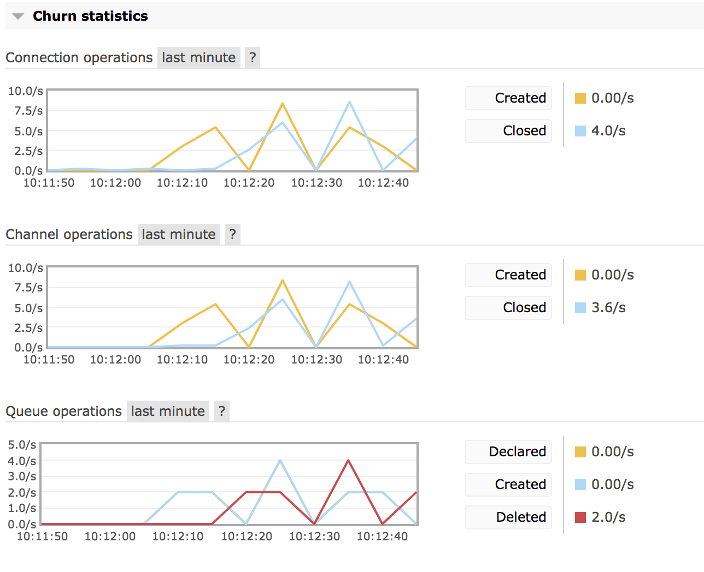

# Resource Churning

Worload created to simulate resource churning in RabbitMQ. Churning refers to act of declaring and deleting resources within a short interval. And the resources could be exchanges, queues and bindings.

## Getting started

This workload assumes we are going to run the workload against a RabbitMQ cluster when we deploy
[rabbitmq-server-boshrelease](https://github.com/rabbitmq/rabbitmq-server-boshrelease) with BOSH. This release offers us the possibility of deploying a VM with [RabbitMQ Perf-Test](https://github.com/rabbitmq/rabbitmq-perf-test) along with a RabbitMQ Cluster.

This workload consists of a number of scripts that produces resource churning load. To use it we first need to install it on the VM where we have PerfTest installed.

> We can run this workload from anywhere we want. All we need to do is produce a setup script similar to this one with 2 environment variables. HOSTNAMES which is a comma-separated list of RabbitMQ servers and RABBITMQ_PASS which is the password of a RabbitMQ user called `admin`:
>
> export HOSTNAMES=10.0.1.6,10.0.1.15,10.0.1.23,10.0.1.24,10.0.1.25,  
> export RABBITMQ_PASS=xIpYNEY2JeaKTGPXovpU


1. Deploy `rabbitmq-server-boshrelease` with the following property `rmq_deploy_benchmark_tool: true`. This will deploy a RabbitMQ cluster with a `perftest` VM.
2. Run `./install <bosh-deployment-name>`. This will copy this workload into the `perftest` vm in the BOSH deployment
3. To complete the installation proceed as follows:
  ```
  bosh -d  <bosh-deployment-name> ssh perftest
  mkdir resource-churning
  tar -xzvf /tmp/resource-churning*.gz -C resource-churning
  cd resource-churning
  ```


## Producing Queue churning

Run the following script to produce **2 concurrent queue churners**. Each concurrent queue churner will create 10 queues, publish/consume messages to/from it for **10 seconds**, and delete the queues afterwards. And it will do it **10 times**. The script terminates with the message `All queue churners completed!` when the 2 concurrent queue churners have both terminated.
```
./queue_churners 2
```

The syntax is as follows:
```
./queue_churners
  <concurrent_queue_churners>
  <queues_per_queue_churner>
  <queue_churner_iterations>
  <queue_churner_min_duration>
  <queue_churner_max_duration>
```
A single `queue_churner` creates as many queues as indicated in `<queues_per_queue_churner>` parameter, it iterates as many times as indicated by `<queue_churner_iterations>` and it publishes and consumes messages for a random number of seconds between `<queue_churner_min_duration>` and `<queue_churner_max_duration>`.

This command launches 20 concurrent `queue_churners` which churns 5 queues each, 100000 times and spending between 1 and 2 seconds publishing and consuming messages.

```
./queue_churners 20 5 100000 1 2
```

Since 3.8.0, we can monitor the queue churning statistics in the overview page of the management ui as shown the screenshot below.


